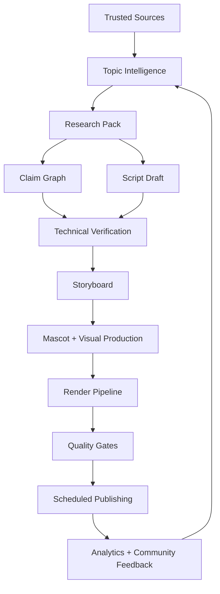
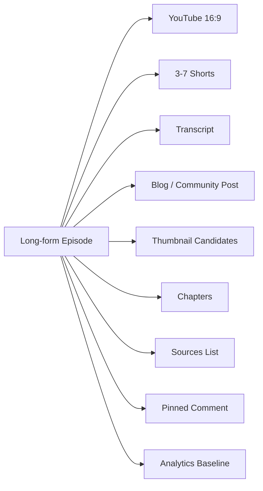

# Animus News

**Animus News** is a source-grounded, production-grade media system for creating high-quality educational IT content around the Animus open-source community.

The project is not intended to become a low-quality AI video generator. Its purpose is to become a rigorous **content compiler**: a system that transforms trusted sources, community knowledge, engineering practice, and editorial standards into reliable educational media.

## Mission

Animus News explains how modern technology works:

- open-source communities and contributor journeys;
- networking, protocols, distributed systems, and production infrastructure;
- production engineering, CI/CD, observability, reliability, and incident response;
- AI systems and AI-assisted engineering workflows without hype;
- programming languages through their philosophy, strengths, limitations, and practical usage;
- high-reputation applications, tools, platforms, and systems that shaped professional workflows.

The goal is to build an educational media engine that is precise, trustworthy, visually clear, and valuable for both new and experienced engineers.

## Core principle

> AI may accelerate production, but it must not replace source-grounded engineering judgment.

Every episode must be traceable from source material to claims, script, storyboard, assets, QA, publication metadata, and analytics.

## System overview

## Documentation map

Start here:

- [System Blueprint](docs/SYSTEM_BLUEPRINT.md) — complete architecture and end-to-end design.
- [Editorial Standard](docs/EDITORIAL_STANDARD.md) — content mission, formats, voice, mascot, and quality bar.
- [Security and Safety](docs/SECURITY_AND_SAFETY.md) — threat model, AI safety, supply chain, secrets, platform safety, and abuse prevention.
- [Quality Gates](docs/QUALITY_GATES.md) — acceptance criteria from topic approval to publication.
- [Operations](docs/OPERATIONS.md) — production operations, workflows, incidents, observability, cost control, and release process.
- [Schemas](docs/SCHEMAS.md) — canonical artifact contracts used throughout the pipeline.
- [Architecture Decisions](docs/ARCHITECTURE_DECISIONS.md) — stable engineering decisions and trade-offs.
- [Roadmap](docs/ROADMAP.md) — phased implementation plan from MVP to production-grade system.
- [Contributing](CONTRIBUTING.md) — how to contribute to the project.
- [Security Policy](SECURITY.md) — how to report security issues.

## Non-goals

Animus News is explicitly **not**:

- a spammy AI content farm;
- a channel for shallow news summaries;
- a reused-content pipeline;
- a system that publishes LLM output without verification;
- a synthetic media system that imitates real people or misleads viewers;
- a replacement for editorial responsibility.

## Invariants

1. No claim without a source.
2. No script without a research pack.
3. No render without technical verification.
4. No publication without QA.
5. No reused content without meaningful transformation.
6. No AI output as final authority.
7. No silent production failure.
8. Every episode must be replayable from artifacts.
9. Every generated asset must have provenance.
10. Every optimization must preserve trust.

## Target outputs

Each approved long-form episode should produce a complete distribution pack:

## Preferred implementation posture

The system should be built as a deterministic, auditable workflow engine around AI-assisted steps:

- durable workflow orchestration;
- typed artifacts;
- source-grounded retrieval;
- claim extraction and verification;
- deterministic rendering where possible;
- explicit approval gates;
- immutable artifact storage;
- full observability;
- strict safety policies.

## License

License is intentionally not declared yet. Before accepting external contributions, the project should choose and add an explicit open-source license.
