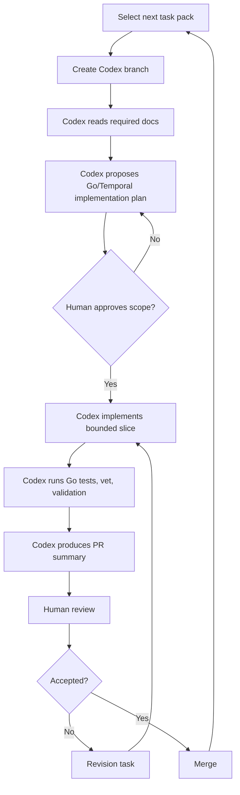
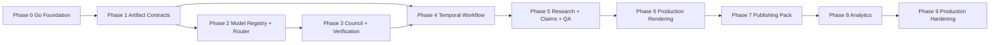

# Codex Master Implementation Plan

> **Status: target design, not current implementation.** This document describes
> the intended target system and implementation backlog. For authoritative,
> code-backed status see [`PRODUCTION_READINESS.md`](PRODUCTION_READINESS.md).
> **Implemented today:** the short-form (M1–L2) typed-contract / gate /
> `ShortFormWorkflow` slice running end-to-end on mock and fail-closed
> (disabled-by-default) providers — no live calls, no spend, no public publishing.

## 1. Purpose

This document is the implementation backlog for building Animus News into a production-grade, source-grounded, multimodel content compiler.

Codex must not be asked to implement the whole system in one pass. Codex must execute this plan as small, bounded, reviewable task packs.

## 2. Canonical implementation stack

The canonical production implementation stack is:

- **Go / Golang** for backend services, CLIs, artifact schemas, validation, model routing, provider adapters, multimodel council, verification, QA, publishing adapters, analytics adapters, security utilities, and workers.
- **Temporal** for durable workflow orchestration, retries, long-running episode lifecycle execution, human-in-the-loop waits, provider fallback flows, release gates, and replayable production state.
- **Postgres** for durable application state when persistence is introduced.
- **S3-compatible object storage** for immutable artifacts, assets, renders, source evidence bundles, and manifests.
- **Provider-agnostic model adapters** for multimodel execution.
- **Deterministic rendering workers** behind Temporal activities.

TypeScript/Node.js is not the default backend stack. TypeScript may be introduced later only for frontend/editorial console work, Remotion-specific rendering code, or isolated UI tooling via explicit ADR.

This document supersedes earlier TypeScript-oriented task descriptions. If any task pack still mentions `package.json`, `pnpm`, `Zod`, `Vitest`, or `src/**` as TypeScript paths, Codex must translate them to the Go/Temporal equivalents described in `docs/GO_TEMPORAL_IMPLEMENTATION_PLAN.md`.

## 3. Execution model



## 4. Global constraints for every task

Codex must obey:

- `AGENTS.md`;
- `docs/SYSTEM_BLUEPRINT.md`;
- `docs/GO_TEMPORAL_IMPLEMENTATION_PLAN.md`;
- `docs/MULTIMODEL_STRATEGY.md`;
- `docs/QUALITY_GATES.md`;
- `docs/SECURITY_AND_SAFETY.md`;
- `docs/SCHEMAS.md`;
- `docs/ARCHITECTURE_DECISIONS.md`;
- the task-specific scope.

Global forbidden changes:

- do not remove or weaken quality gates;
- do not add direct public publishing;
- do not hard-code one model provider as final authority;
- do not bypass human QA;
- do not add secrets or real credentials;
- do not rewrite unrelated docs;
- do not rename canonical artifacts without ADR;
- do not add unsafe content-generation workflows;
- do not introduce unbounded internet ingestion without sandboxing and policy controls;
- do not replace Go/Temporal as production backend/orchestration stack without ADR.

## 5. Go/Temporal translation table

| Earlier wording | Correct Go/Temporal interpretation |
|---|---|
| `package.json` | `go.mod`, `go.sum`, `Makefile` or `Taskfile.yml` |
| `pnpm test` | `go test ./...` |
| `pnpm typecheck` | `go test ./...` plus `go vet ./...` |
| Zod schemas | Go structs plus validation and optional JSON Schema generation |
| Vitest | Go `testing` package |
| Commander CLI | Cobra, urfave/cli, or standard-library CLI |
| `src/**` | `cmd/**`, `internal/**`, `pkg/**` |
| mock providers in TypeScript | Go mock adapters |
| validation CLI in TypeScript | Go CLI under `cmd/animus-news` |
| workflow state machine only | Temporal workflow plus reusable validation/state helpers |

## 6. Recommended Go package layout

```text
cmd/animus-news/
  main.go

internal/artifacts/
internal/schemas/
internal/sources/
internal/models/
  registry/
  router/
  adapters/
  mock/
internal/council/
internal/verification/
internal/workflows/
internal/activities/
internal/storyboard/
internal/render/
internal/publishing/
internal/analytics/
internal/audit/
internal/security/
internal/cost/
internal/config/

pkg/api/
  types.go
```

Rules:

- `internal/workflows` contains deterministic Temporal workflow code only.
- Provider calls, filesystem I/O, rendering, publishing, model calls, source ingestion, and secret scanning belong in activities or ordinary non-workflow services, not directly in workflow code.
- Provider-specific code must remain behind adapters.
- Artifact validation must be reusable from CLI and Temporal activities.

## 7. Phase dependency graph



## 8. Task pack index

| Task | Title | Phase | Depends on |
|---|---|---:|---|
| ACC-000 | Add Go repo tooling baseline | 0 | none |
| ACC-001 | Add CI for Go tests, docs, schemas, secrets | 0 | ACC-000 |
| ACC-002 | Implement canonical artifact structs and validators | 1 | ACC-000 |
| ACC-003 | Add Go artifact validation CLI | 1 | ACC-002 |
| ACC-004 | Add pilot episode artifact template | 1 | ACC-003 |
| ACC-005 | Implement model registry schema and config | 2 | ACC-002 |
| ACC-006 | Implement model provider adapter interface | 2 | ACC-005 |
| ACC-007 | Implement model task router | 2 | ACC-006 |
| ACC-008 | Implement mock model providers | 2 | ACC-006 |
| ACC-009 | Implement multimodel council reports | 3 | ACC-007, ACC-008 |
| ACC-010 | Implement claim verification activities/helpers | 3 | ACC-009 |
| ACC-011 | Implement Temporal episode workflow skeleton | 4 | ACC-003 |
| ACC-012 | Enforce artifact dependency graph in workflow gates | 4 | ACC-011 |
| ACC-013 | Implement source registry and trust ranking | 5 | ACC-003 |
| ACC-014 | Implement research pack builder activity MVP | 5 | ACC-013, ACC-007 |
| ACC-015 | Implement script claim extractor activity MVP | 5 | ACC-014 |
| ACC-016 | Implement human QA decision packets and signals | 5 | ACC-010, ACC-015 |
| ACC-017 | Implement storyboard generator activity MVP | 6 | ACC-016 |
| ACC-018 | Implement deterministic render/preview activity spike | 6 | ACC-017 |
| ACC-019 | Implement production QA activity checks | 6 | ACC-018 |
| ACC-020 | Implement publish pack generator activity | 7 | ACC-019 |
| ACC-021 | Implement private/scheduled publishing adapter interface | 7 | ACC-020 |
| ACC-022 | Implement analytics import interfaces | 8 | ACC-021 |
| ACC-023 | Implement analytics insight activity reports | 8 | ACC-022 |
| ACC-024 | Add audit logging | 9 | ACC-011 |
| ACC-025 | Add cost tracking | 9 | ACC-007 |
| ACC-026 | Add provider health and fallback policy | 9 | ACC-007 |
| ACC-027 | Add security scanning and redaction utilities | 9 | ACC-001 |
| ACC-028 | Add production runbooks | 9 | ACC-019, ACC-021 |
| ACC-029 | End-to-end Go/Temporal dry run for pilot episode | 9 | ACC-004 through ACC-023 |

## 9. Revised phase 0 baseline

### ACC-000 — Add Go repo tooling baseline

Goal: create a minimal production-oriented Go module without implementing domain business logic.

Allowed files:

- `go.mod`
- `go.sum`
- `Makefile` or `Taskfile.yml`
- `.gitignore`
- `cmd/animus-news/**`
- `internal/**`
- `pkg/**`
- `tests/**` if used

Implementation requirements:

- initialize Go module;
- add CLI entrypoint under `cmd/animus-news`;
- add baseline packages under `internal/`;
- add smoke test;
- add Make targets or equivalent for:
  - `test`;
  - `vet`;
  - `fmt`;
  - `validate` placeholder if validation is not implemented yet.

Validation commands:

```bash
go test ./...
go vet ./...
go fmt ./...
```

### ACC-001 — Add CI for Go tests, docs, schemas, and secrets

Goal: add GitHub Actions for Go-based validation.

CI should run:

```bash
go test ./...
go vet ./...
go fmt ./...
```

If secret scanning exists, run it. If markdown/Mermaid validation exists, run it.

## 10. Revised Temporal workflow task

### ACC-011 — Implement Temporal episode workflow skeleton

Goal: encode the episode lifecycle as a Temporal workflow using deterministic workflow code and activity boundaries.

Workflow:

```text
EpisodeLifecycleWorkflow
```

Signals:

```text
HumanQADecisionSignal
ReleaseApprovalSignal
BlockEpisodeSignal
RequestRevisionSignal
AttachCorrectionSignal
```

Queries:

```text
GetEpisodeStateQuery
GetCurrentArtifactsQuery
GetBlockingIssuesQuery
GetCouncilStatusQuery
GetCostSummaryQuery
```

Acceptance criteria:

- workflow compiles;
- workflow unit tests use Temporal Go SDK test environment;
- workflow does not call providers, filesystem, network, random, or wall-clock directly;
- side effects are represented as activities;
- invalid state transitions fail;
- human QA wait is represented as signal/update flow or equivalent.

## 11. Codex prompt template

Use this template for every task:

```text
You are implementing a bounded Animus News Go/Temporal task pack.

Read first:
- AGENTS.md
- README.md
- docs/SYSTEM_BLUEPRINT.md
- docs/GO_TEMPORAL_IMPLEMENTATION_PLAN.md
- docs/MULTIMODEL_STRATEGY.md
- docs/QUALITY_GATES.md
- docs/SECURITY_AND_SAFETY.md
- docs/SCHEMAS.md
- docs/ARCHITECTURE_DECISIONS.md
- docs/CODEX_USAGE.md
- docs/CODEX_MASTER_PLAN.md

Task pack:
<copy one ACC task here>

Rules:
- Implement in Go unless this task explicitly targets frontend/Remotion/UI tooling.
- Use Temporal for durable orchestration tasks.
- Keep workflow code deterministic.
- Put side effects in activities.
- Stay within allowed files unless absolutely necessary.
- Do not weaken security, quality gates, provenance, multimodel independence, or human QA.
- Do not introduce real secrets or provider credentials.
- Add Go tests.
- Run relevant checks.
- Return changed files, commands run, assumptions, risks, and follow-ups.
```

## 12. Final production definition

Animus News reaches production readiness when ACC-000 through ACC-029 are complete, Go tests pass, Temporal workflow tests pass, the dry-run pilot works end-to-end, no direct public publishing path exists, and the human-reviewed release procedure is documented and rehearsed.
