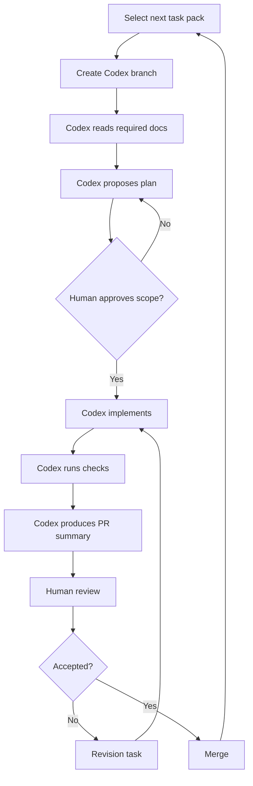
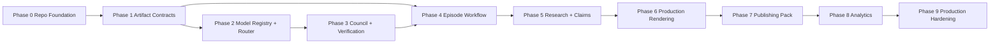

# Codex Master Implementation Plan

## 1. Purpose

This document is the implementation backlog for building Animus News into a production-grade, source-grounded, multimodel content compiler.

Codex must not be asked to implement the whole system in one pass. Codex must execute this plan as small, bounded, reviewable task packs.

## 2. Execution model



## 3. Global constraints for every task

Codex must obey:

- `AGENTS.md`;
- `docs/SYSTEM_BLUEPRINT.md`;
- `docs/MULTIMODEL_STRATEGY.md`;
- `docs/QUALITY_GATES.md`;
- `docs/SECURITY_AND_SAFETY.md`;
- `docs/SCHEMAS.md`;
- `docs/ARCHITECTURE_DECISIONS.md`;
- the task-specific scope below.

Global forbidden changes:

- do not remove or weaken quality gates;
- do not add direct public publishing;
- do not hard-code one model provider as final authority;
- do not bypass human QA;
- do not add secrets or real credentials;
- do not rewrite unrelated docs;
- do not rename canonical artifacts without ADR;
- do not add unsafe content-generation workflows;
- do not introduce unbounded internet ingestion without sandboxing and policy controls.

## 4. Recommended stack baseline

The final stack may evolve through ADRs, but the initial implementation should optimize for developer speed and strong contracts.

Recommended initial stack:

- TypeScript;
- Node.js LTS;
- pnpm;
- Zod for runtime schemas;
- JSON Schema export where useful;
- Vitest for tests;
- Commander or similar for CLI;
- Postgres later for persistence;
- filesystem artifact store for MVP;
- provider adapters behind interfaces;
- Remotion later for rendering;
- GitHub Actions for CI.

If Codex proposes another stack, it must create an ADR before changing the baseline.

## 5. Phase dependency graph



## 6. Task pack index

| Task | Title | Phase | Depends on |
|---|---|---:|---|
| ACC-000 | Add repo tooling baseline | 0 | none |
| ACC-001 | Add CI for docs, tests, schemas, secrets | 0 | ACC-000 |
| ACC-002 | Implement canonical artifact schemas | 1 | ACC-000 |
| ACC-003 | Add artifact validation CLI | 1 | ACC-002 |
| ACC-004 | Add pilot episode artifact template | 1 | ACC-003 |
| ACC-005 | Implement model registry schema and config | 2 | ACC-002 |
| ACC-006 | Implement model provider adapter interface | 2 | ACC-005 |
| ACC-007 | Implement model task router | 2 | ACC-006 |
| ACC-008 | Implement mock model providers | 2 | ACC-006 |
| ACC-009 | Implement multimodel council reports | 3 | ACC-007, ACC-008 |
| ACC-010 | Implement claim verification workflow | 3 | ACC-009 |
| ACC-011 | Implement episode state machine | 4 | ACC-003 |
| ACC-012 | Enforce artifact dependency graph | 4 | ACC-011 |
| ACC-013 | Implement source registry and trust ranking | 5 | ACC-003 |
| ACC-014 | Implement research pack builder MVP | 5 | ACC-013, ACC-007 |
| ACC-015 | Implement script claim extractor MVP | 5 | ACC-014 |
| ACC-016 | Implement human QA decision packets | 5 | ACC-010, ACC-015 |
| ACC-017 | Implement storyboard generator MVP | 6 | ACC-016 |
| ACC-018 | Implement deterministic render template spike | 6 | ACC-017 |
| ACC-019 | Implement production QA checks | 6 | ACC-018 |
| ACC-020 | Implement publish pack generator | 7 | ACC-019 |
| ACC-021 | Implement private/scheduled publishing adapter interface | 7 | ACC-020 |
| ACC-022 | Implement analytics import interfaces | 8 | ACC-021 |
| ACC-023 | Implement analytics insight reports | 8 | ACC-022 |
| ACC-024 | Add audit logging | 9 | ACC-011 |
| ACC-025 | Add cost tracking | 9 | ACC-007 |
| ACC-026 | Add provider health and fallback policy | 9 | ACC-007 |
| ACC-027 | Add security scanning and redaction utilities | 9 | ACC-001 |
| ACC-028 | Add production runbooks | 9 | ACC-019, ACC-021 |
| ACC-029 | End-to-end dry run for pilot episode | 9 | ACC-004 through ACC-023 |

## 7. Phase 0 — Repository foundation

### ACC-000 — Add repo tooling baseline

**Goal:** Create a minimal, production-oriented TypeScript project foundation without implementing business logic.

**Allowed files:**

- `package.json`
- `pnpm-lock.yaml`
- `tsconfig.json`
- `vitest.config.*`
- `src/**`
- `tests/**`
- `.gitignore`
- `docs/CODEX_MASTER_PLAN.md` only if updating task status

**Non-goals:**

- no model provider integrations;
- no rendering;
- no publishing;
- no database;
- no real episode generation.

**Implementation requirements:**

- initialize TypeScript project;
- add `pnpm` scripts:
  - `test`;
  - `typecheck`;
  - `lint` if a linter is added;
  - `validate` placeholder or initial implementation;
- add baseline source layout:
  - `src/index.ts`;
  - `src/core/`;
  - `src/schemas/`;
  - `src/cli/`;
  - `src/models/`;
  - `src/workflow/`;
- add first smoke test.

**Acceptance criteria:**

- package installs cleanly;
- `pnpm test` passes;
- `pnpm typecheck` passes;
- no unrelated docs rewritten.

**Codex PR summary must include:**

- chosen package versions;
- commands run;
- any environment limitations.

---

### ACC-001 — Add CI for docs, tests, schemas, secrets

**Goal:** Add GitHub Actions CI that verifies the repository baseline.

**Allowed files:**

- `.github/workflows/**`
- `package.json`
- docs if documenting commands

**Implementation requirements:**

- run install;
- run typecheck;
- run tests;
- run validation command if present;
- add a simple secret scanning step or placeholder script;
- do not require paid external services.

**Acceptance criteria:**

- CI workflow is syntactically valid;
- local commands match CI commands;
- no secrets committed.

## 8. Phase 1 — Artifact contracts

### ACC-002 — Implement canonical artifact schemas

**Goal:** Implement runtime schemas for canonical pipeline artifacts.

**Allowed files:**

- `src/schemas/**`
- `schemas/**`
- `tests/schemas/**`
- `examples/**`
- `docs/SCHEMAS.md` only if aligning examples

**Artifacts to cover:**

- topic;
- source;
- research pack;
- claim set;
- verification report;
- multimodel approval report;
- human QA report;
- storyboard;
- asset manifest;
- render manifest;
- production QA report;
- publish manifest;
- analytics report.

**Requirements:**

- implement Zod schemas or equivalent;
- export TypeScript types;
- include strict required fields;
- validate `schema_version`;
- include status enums;
- include artifact dependency metadata;
- include model/provider metadata where relevant.

**Acceptance criteria:**

- valid examples pass;
- invalid examples fail;
- every schema has tests;
- no schema silently accepts unknown critical fields unless explicitly designed.

---

### ACC-003 — Add artifact validation CLI

**Goal:** Provide a CLI for validating artifact files and episode directories.

**Allowed files:**

- `src/cli/**`
- `src/schemas/**`
- `tests/cli/**`
- `package.json`

**Commands:**

```text
animus-news validate <path>
animus-news validate-episode <episode-dir>
```

**Requirements:**

- validate single artifacts by inferred type;
- validate complete episode directory;
- emit readable errors;
- non-zero exit on validation failure;
- machine-readable JSON output option.

**Acceptance criteria:**

- CLI validates examples;
- CLI rejects invalid examples;
- tests cover missing required files;
- tests cover invalid status transitions if implemented.

---

### ACC-004 — Add pilot episode artifact template

**Goal:** Add a fully structured sample episode for `What happens after git push?` using placeholder content where needed.

**Allowed files:**

- `episodes/0001-after-git-push/**`
- `examples/**`
- docs if linking pilot

**Requirements:**

- include every canonical artifact file;
- mark incomplete items clearly as placeholders;
- include at least 5 source-backed sample claims;
- validate with CLI;
- do not add generated video binaries.

**Acceptance criteria:**

- `validate-episode episodes/0001-after-git-push` passes;
- all sample claims have source IDs;
- no private data or secrets.

## 9. Phase 2 — Model registry and routing

### ACC-005 — Implement model registry schema and config

**Goal:** Add a provider-agnostic model registry.

**Allowed files:**

- `src/models/registry/**`
- `config/model-registry.example.yaml`
- `tests/models/**`
- `docs/MULTIMODEL_STRATEGY.md` if needed

**Requirements:**

- model ID;
- provider;
- version;
- modalities;
- capabilities;
- privacy tier;
- cost profile;
- latency profile;
- benchmark scores;
- known failure modes;
- status: `active | degraded | disabled`.

**Acceptance criteria:**

- registry config validates;
- disabled models are not selectable;
- privacy tier is enforced at selection time or exposed for router enforcement;
- tests cover invalid model records.

---

### ACC-006 — Implement model provider adapter interface

**Goal:** Define stable interfaces for all model providers.

**Allowed files:**

- `src/models/adapters/**`
- `src/models/types.ts`
- `tests/models/**`

**Requirements:**

- provider-agnostic request type;
- provider-agnostic response type;
- normalized error classes;
- structured output validation hook;
- cost/latency metadata;
- no real API keys;
- no hard-coded default authority model.

**Acceptance criteria:**

- mock adapter compiles;
- adapter contract tests pass;
- provider failure maps to normalized errors.

---

### ACC-007 — Implement model task router

**Goal:** Route tasks to appropriate models or model panels based on task type, risk, modality, privacy, cost, and benchmarks.

**Allowed files:**

- `src/models/router/**`
- `src/models/registry/**`
- `tests/models/router/**`

**Requirements:**

- classify task category;
- filter by capability;
- filter by privacy tier;
- filter disabled/degraded providers;
- select single model for low-risk task;
- select model panel for high-risk task;
- return explanation of routing decision.

**Acceptance criteria:**

- tests cover low/medium/high risk selection;
- tests cover privacy mismatch blocking;
- tests cover provider fallback;
- route explanation includes selected and rejected candidates.

---

### ACC-008 — Implement mock model providers

**Goal:** Allow local development and testing without real model providers.

**Allowed files:**

- `src/models/mock/**`
- `tests/models/mock/**`

**Requirements:**

- deterministic mock outputs;
- configurable failure modes;
- configurable latency/cost metadata;
- mock reviewer outputs: approve, reject, request revision;
- no network calls.

**Acceptance criteria:**

- tests run offline;
- council can use mock models;
- failure scenarios are testable.

## 10. Phase 3 — Multimodel council and verification

### ACC-009 — Implement multimodel council reports

**Goal:** Aggregate outputs from multiple reviewer models into a council report.

**Allowed files:**

- `src/council/**`
- `src/models/**`
- `tests/council/**`
- `schemas/**` if needed

**Requirements:**

- collect reviewer verdicts;
- preserve dissent;
- compute consensus status;
- list blocking objections;
- include model/provider metadata;
- include confidence scores;
- output canonical `multimodel_approval_report`.

**Acceptance criteria:**

- unanimous approval passes;
- technical blocker fails;
- dissent is preserved;
- same model cannot self-approve its own generated artifact unless explicitly tagged as separate role and allowed by policy.

---

### ACC-010 — Implement claim verification workflow

**Goal:** Verify claims against sources using model council outputs and deterministic checks.

**Allowed files:**

- `src/verification/**`
- `src/council/**`
- `tests/verification/**`

**Requirements:**

- load claims and sources;
- call verifier panel through router;
- mark claims supported/unsupported/contradicted/needs review;
- block high-risk unsupported claims;
- generate `verification_report.json`.

**Acceptance criteria:**

- unsupported high-risk claim blocks progression;
- low-risk wording issue can request revision;
- report contains evidence locator references;
- tests use mock providers.

## 11. Phase 4 — Episode workflow

### ACC-011 — Implement episode state machine

**Goal:** Encode lifecycle states and allowed transitions.

**Allowed files:**

- `src/workflow/**`
- `tests/workflow/**`

**States:**

- backlog;
- candidate;
- approved_topic;
- researching;
- research_ready;
- drafting;
- verifying;
- human_qa;
- storyboarding;
- asset_production;
- rendering;
- production_qa;
- scheduled;
- published;
- monitored;
- archived;
- blocked.

**Acceptance criteria:**

- invalid transitions fail;
- valid transitions pass;
- blocked states require explicit unblock transition;
- tests cover the happy path and at least 5 invalid transitions.

---

### ACC-012 — Enforce artifact dependency graph

**Goal:** Prevent stage transitions when required upstream artifacts are missing, invalid, stale, or rejected.

**Allowed files:**

- `src/workflow/**`
- `src/artifacts/**`
- `tests/workflow/**`

**Requirements:**

- define artifact dependency graph;
- validate required files for each state;
- detect rejected/superseded upstream artifacts;
- require QA reports before release states.

**Acceptance criteria:**

- cannot enter `verifying` without claims and script;
- cannot enter `storyboarding` without human QA approval;
- cannot enter `scheduled` without production QA approval;
- tests cover dependency failures.

## 12. Phase 5 — Research, claims, and human QA

### ACC-013 — Implement source registry and trust ranking

**Goal:** Manage source metadata, trust levels, hashes, and license notes.

**Allowed files:**

- `src/sources/**`
- `tests/sources/**`

**Requirements:**

- source types;
- trust levels;
- content hash;
- license notes;
- source locator support;
- ranking function.

**Acceptance criteria:**

- primary sources outrank secondary sources;
- community signals cannot satisfy high-risk claim authority alone;
- missing license notes produce warning or failure based on asset type.

---

### ACC-014 — Implement research pack builder MVP

**Goal:** Build research packs from explicitly supplied sources.

**Allowed files:**

- `src/research/**`
- `tests/research/**`

**Non-goals:**

- no uncontrolled web crawler;
- no arbitrary internet browsing;
- no automatic source trust without ranking.

**Requirements:**

- input: topic + source registry entries + extracted text snippets;
- output: research pack;
- include terminology;
- include forbidden simplifications;
- include source coverage report;
- include unresolved questions.

**Acceptance criteria:**

- missing primary source for high-risk topic is flagged;
- output validates against schema;
- tests use deterministic fixtures.

---

### ACC-015 — Implement script claim extractor MVP

**Goal:** Extract factual claims from a script draft.

**Allowed files:**

- `src/claims/**`
- `tests/claims/**`

**Requirements:**

- parse script markdown;
- extract candidate claims;
- classify claim type and risk;
- link obvious claims to research pack source IDs when possible;
- flag unlinked claims.

**Acceptance criteria:**

- test script produces expected claim set;
- unlinked technical claims are flagged;
- output validates.

---

### ACC-016 — Implement human QA decision packets

**Goal:** Produce concise review packets for human operators.

**Allowed files:**

- `src/qa/**`
- `tests/qa/**`

**Requirements:**

- combine research summary, script summary, claim risks, model council results, dissent, and required checks;
- output `human_qa_packet` or `human_qa_report` draft;
- include recommended decision;
- preserve unresolved risks.

**Acceptance criteria:**

- packet includes dissenting model comments;
- packet includes unsupported claims if any;
- packet cannot hide blocking issues;
- tests cover approve/revise/block recommendations.

## 13. Phase 6 — Storyboard and rendering

### ACC-017 — Implement storyboard generator MVP

**Goal:** Convert approved script into structured storyboard scenes.

**Allowed files:**

- `src/storyboard/**`
- `tests/storyboard/**`

**Requirements:**

- segment script into scenes;
- assign mascot mode;
- assign visual type;
- assign captions/on-screen text;
- generate storyboard artifact;
- use mock model or deterministic heuristics for MVP.

**Acceptance criteria:**

- storyboard validates;
- every scene has narration and visual plan;
- no scene exceeds configured max duration unless justified.

---

### ACC-018 — Implement deterministic render template spike

**Goal:** Render a storyboard into a local preview video or HTML preview using deterministic assets.

**Allowed files:**

- `src/render/**`
- `render/**`
- `tests/render/**`
- package config as needed

**Requirements:**

- no generated binary committed unless explicitly small fixture;
- placeholder mascot allowed;
- terminal/code/diagram scenes supported as placeholders;
- produce render manifest;
- preserve asset provenance.

**Acceptance criteria:**

- sample storyboard renders or previews locally;
- render manifest validates;
- render failure is explicit and non-silent.

---

### ACC-019 — Implement production QA checks

**Goal:** Validate rendered outputs before publishing.

**Allowed files:**

- `src/production-qa/**`
- `tests/production-qa/**`

**Checks:**

- required output files exist;
- render manifest valid;
- subtitles exist if required;
- asset provenance present;
- no missing source-backed claims;
- no direct public publish flag;
- synthetic disclosure status present.

**Acceptance criteria:**

- missing asset provenance fails;
- missing QA approval blocks publish state;
- output QA report validates.

## 14. Phase 7 — Publishing

### ACC-020 — Implement publish pack generator

**Goal:** Generate metadata package for publication without uploading publicly.

**Allowed files:**

- `src/publishing/**`
- `tests/publishing/**`

**Requirements:**

- generate title candidates;
- generate description draft;
- include source list where appropriate;
- generate chapters from storyboard;
- generate pinned comment draft;
- generate community post draft;
- output publish manifest draft.

**Acceptance criteria:**

- generated manifest has `visibility: private | scheduled`, never public by default;
- sources included;
- CTA included;
- tests cover metadata validation.

---

### ACC-021 — Implement private/scheduled publishing adapter interface

**Goal:** Define safe publishing adapters without forcing real uploads.

**Allowed files:**

- `src/publishing/adapters/**`
- `tests/publishing/**`

**Requirements:**

- adapter interface for upload draft;
- adapter interface for schedule;
- dry-run adapter;
- no real credentials;
- public upload requires human release approval flag and explicit config;
- direct public upload path forbidden.

**Acceptance criteria:**

- dry run works;
- public visibility without approval fails;
- adapter tests run offline.

## 15. Phase 8 — Analytics

### ACC-022 — Implement analytics import interfaces

**Goal:** Define provider-agnostic analytics ingestion interfaces.

**Allowed files:**

- `src/analytics/**`
- `tests/analytics/**`

**Requirements:**

- import CTR;
- retention;
- average view duration;
- comments count;
- community conversions;
- cost per episode;
- no hard dependency on YouTube API in core.

**Acceptance criteria:**

- fixture analytics import validates;
- provider adapter interface exists;
- analytics report schema validates.

---

### ACC-023 — Implement analytics insight reports

**Goal:** Generate recommendations from analytics without bypassing editorial gates.

**Allowed files:**

- `src/analytics/**`
- `tests/analytics/**`

**Requirements:**

- summarize performance;
- flag retention drop-offs;
- suggest topic/format improvements;
- explicitly prohibit clickbait recommendations;
- output analytics report.

**Acceptance criteria:**

- low CTR suggests title/thumbnail review, not misleading clickbait;
- factual corrections trigger review workflow;
- recommendations are advisory only.

## 16. Phase 9 — Production hardening

### ACC-024 — Add audit logging

**Goal:** Record important decisions and transitions.

**Requirements:**

- log artifact approvals;
- log state transitions;
- log model routing decisions;
- log human QA decisions;
- no secrets in logs.

**Acceptance criteria:**

- audit entries are structured;
- tests cover secret redaction;
- every release transition logs human approval.

---

### ACC-025 — Add cost tracking

**Goal:** Track model, rendering, and publishing costs per episode.

**Requirements:**

- cost event type;
- aggregate by episode/stage/provider;
- enforce optional budget limit;
- cost report.

**Acceptance criteria:**

- budget exceed can block non-critical automation;
- cost report validates;
- tests cover aggregation.

---

### ACC-026 — Add provider health and fallback policy

**Goal:** Allow graceful degradation when providers fail.

**Requirements:**

- provider health state;
- degraded/disabled model exclusion;
- fallback selection;
- failure reason recorded.

**Acceptance criteria:**

- disabled provider is not selected;
- degraded provider only selected if policy allows;
- fallback decision is logged.

---

### ACC-027 — Add security scanning and redaction utilities

**Goal:** Reduce risk of secrets and private data leaking into artifacts.

**Requirements:**

- scan artifacts for common secret patterns;
- redact configured sensitive values;
- fail release if high-risk secret found;
- integrate with CI where possible.

**Acceptance criteria:**

- fake token fixture is detected;
- redaction works in logs;
- release state blocked on unredacted secret.

---

### ACC-028 — Add production runbooks

**Goal:** Add operational runbooks for incidents and releases.

**Allowed files:**

- `docs/runbooks/**`

**Runbooks:**

- release checklist;
- factual correction;
- private data exposure;
- provider outage;
- render failure;
- publishing failure;
- model council disagreement;
- cost budget exceeded.

**Acceptance criteria:**

- each runbook has detection, containment, resolution, prevention;
- linked from `docs/OPERATIONS.md`.

---

### ACC-029 — End-to-end dry run for pilot episode

**Goal:** Prove the MVP pipeline from episode artifacts to publish pack using mocks/dry-run adapters.

**Requirements:**

- validate pilot episode;
- run research/claims verification fixtures;
- run council with mock models;
- produce human QA packet;
- generate storyboard;
- render or preview;
- generate production QA report;
- generate publish pack dry run;
- generate analytics fixture report.

**Acceptance criteria:**

- one command or documented sequence performs dry run;
- no network or secrets required;
- all generated artifacts validate;
- final report lists remaining production gaps.

## 17. Codex prompt template

Use this template for every task:

```text
You are implementing a bounded Animus News task pack.

Read first:
- AGENTS.md
- README.md
- docs/SYSTEM_BLUEPRINT.md
- docs/MULTIMODEL_STRATEGY.md
- docs/QUALITY_GATES.md
- docs/SECURITY_AND_SAFETY.md
- docs/SCHEMAS.md
- docs/ARCHITECTURE_DECISIONS.md
- docs/CODEX_USAGE.md
- docs/CODEX_MASTER_PLAN.md

Task pack:
<copy one ACC task here>

Rules:
- Stay within allowed files unless absolutely necessary.
- Do not weaken security, quality gates, provenance, multimodel independence, or human QA.
- Do not introduce real secrets or provider credentials.
- Add tests.
- Run relevant checks.
- Return changed files, commands run, assumptions, risks, and follow-ups.
```

## 18. Final production definition

Animus News reaches production readiness when ACC-000 through ACC-029 are complete, tests pass, dry-run pilot works end-to-end, and human-reviewed release procedure is documented and rehearsed.
