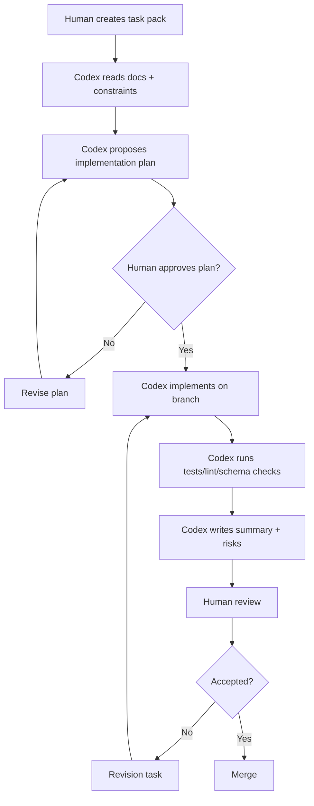

# Codex Usage Strategy

## 1. Purpose

Codex should be used as a controlled engineering accelerator for Animus News, not as an unsupervised system designer.

The goal is to let Codex implement the production system end-to-end through small, auditable, testable slices while preserving architecture, preventing uncontrolled mutations, and keeping human authority over the final system.

## 2. Operating principle

> Codex implements bounded task packs. It does not redefine the architecture unless explicitly asked through an architecture decision workflow.

Codex must work from:

- `README.md`;
- `docs/SYSTEM_BLUEPRINT.md`;
- `docs/MULTIMODEL_STRATEGY.md`;
- `docs/QUALITY_GATES.md`;
- `docs/SCHEMAS.md`;
- `docs/SECURITY_AND_SAFETY.md`;
- `docs/OPERATIONS.md`;
- `docs/ARCHITECTURE_DECISIONS.md`.

## 3. Correct Codex workflow



## 4. Task pack format

Every Codex task should be written as a task pack.

```yaml
task_id: "ACC-001"
title: "Add canonical artifact schemas"
mode: "code"
scope:
  include:
    - "schemas/**"
    - "docs/SCHEMAS.md"
  exclude:
    - "docs/SYSTEM_BLUEPRINT.md"
    - "publishing/**"
non_goals:
  - "Do not implement workflow engine."
  - "Do not add model provider integrations."
requirements:
  - "Create JSON Schema files for topic, research_pack, claims, verification_report."
  - "Add validation script."
  - "Add tests for sample artifacts."
acceptance:
  - "npm test or equivalent passes."
  - "Schema validation rejects missing required fields."
  - "Docs mention generated schema files."
mutation_policy:
  - "Do not rewrite unrelated documentation."
  - "Do not rename established artifacts."
  - "Do not introduce provider-specific dependencies."
review_notes:
  - "Summarize files changed."
  - "List assumptions."
  - "List risks."
```

## 5. Mutation prevention

Codex must be constrained by explicit mutation rules.

### Forbidden by default

- rewriting unrelated files;
- renaming canonical artifacts;
- changing architecture decisions without ADR update;
- replacing provider-agnostic interfaces with provider-specific code;
- removing quality gates;
- bypassing human approval steps;
- adding direct public publishing;
- weakening security or privacy controls;
- changing schemas without migration notes;
- committing generated binary assets without explicit scope.

### Required by default

- work on a separate branch;
- keep changes minimal;
- run tests;
- run schema validation;
- update docs when behavior changes;
- explain assumptions;
- explain risks;
- produce a PR summary;
- include rollback notes for risky changes.

## 6. Branching model

Recommended branch naming:

```text
codex/ACC-001-artifact-schemas
codex/ACC-002-model-registry
codex/ACC-003-workflow-engine-spike
```

Each branch should contain one coherent slice.

Avoid long-running mega-branches.

## 7. Implementation slices

```mermaid
flowchart LR
  S1[Schemas] --> S2[Validation CLI]
  S2 --> S3[Model Registry]
  S3 --> S4[Task Router]
  S4 --> S5[Research Pack Builder]
  S5 --> S6[Claim Extractor]
  S6 --> S7[Council Reports]
  S7 --> S8[Workflow Engine]
  S8 --> S9[Render Template]
  S9 --> S10[Publishing Drafts]
  S10 --> S11[Analytics Loop]
```



## 8. Recommended first Codex tasks

### ACC-001 — Repository skeleton and tooling

- choose runtime;
- add package manager;
- add lint/test scripts;
- add CI workflow;
- add markdown and Mermaid validation if possible.

### ACC-002 — Canonical schemas

- implement JSON Schemas for canonical artifacts;
- add sample valid/invalid artifacts;
- add validation CLI.

### ACC-003 — Episode template

- create `episodes/0001-after-git-push/` sample;
- include topic, research pack, claims, storyboard skeleton;
- validate sample artifacts.

### ACC-004 — Model registry

- add `config/model-registry.yaml`;
- implement model registry loader;
- validate privacy tiers and capabilities.

### ACC-005 — Task router interface

- implement provider-agnostic model task interface;
- no real provider required yet;
- add mock providers and tests.

### ACC-006 — Multimodel council report generator

- implement council report schema;
- aggregate mock reviewer outputs;
- preserve dissent.

### ACC-007 — Research pack builder prototype

- take manually supplied sources;
- generate structured research pack;
- do not browse arbitrary internet by default.

### ACC-008 — Claim extractor prototype

- extract claims from script;
- link claims to sources;
- flag unsupported claims.

### ACC-009 — Workflow state machine

- encode episode lifecycle;
- enforce artifact dependencies;
- block invalid transitions.

### ACC-010 — Render template spike

- create deterministic video template;
- generate placeholder scenes from storyboard;
- produce local preview.

## 9. Codex prompt template

Use this prompt pattern:

```text
You are implementing one bounded slice of Animus News.

Read first:
- README.md
- docs/SYSTEM_BLUEPRINT.md
- docs/MULTIMODEL_STRATEGY.md
- docs/QUALITY_GATES.md
- docs/SCHEMAS.md
- docs/SECURITY_AND_SAFETY.md
- docs/ARCHITECTURE_DECISIONS.md

Task:
<task pack here>

Rules:
- Do not change files outside the scope unless necessary; if necessary, explain why.
- Do not weaken architecture, quality gates, security, or multimodel independence.
- Do not introduce direct public publishing.
- Do not hard-code a single model provider as authority.
- Add or update tests.
- Run available tests and validation.
- Return a summary with changed files, assumptions, risks, and follow-up tasks.
```

## 10. Review checklist for Codex PRs

- [ ] Change matches task pack.
- [ ] No unrelated mutation.
- [ ] No provider lock-in.
- [ ] No weakened quality gate.
- [ ] Schemas validate.
- [ ] Tests pass.
- [ ] Security implications are documented.
- [ ] Docs updated if behavior changed.
- [ ] PR summary lists assumptions and risks.
- [ ] Human reviewer understands rollback path.

## 11. How to use Codex modes

Use ask mode for:

- understanding code;
- mapping architecture;
- proposing refactors;
- reviewing PRs;
- generating diagrams;
- identifying risks.

Use code mode for:

- implementing bounded slices;
- adding tests;
- fixing CI;
- refactoring within a declared scope;
- generating schemas;
- creating typed interfaces;
- creating CLI tools.

Do not use code mode for vague tasks like “implement the whole system.”

## 12. Definition of safe Codex completion

A Codex task is complete only when:

- it satisfies the task pack;
- tests/checks are run or limitations are stated;
- no unrelated files are mutated;
- all generated artifacts validate;
- assumptions are listed;
- risks are listed;
- follow-up tasks are proposed;
- human review is possible from the PR summary alone.
