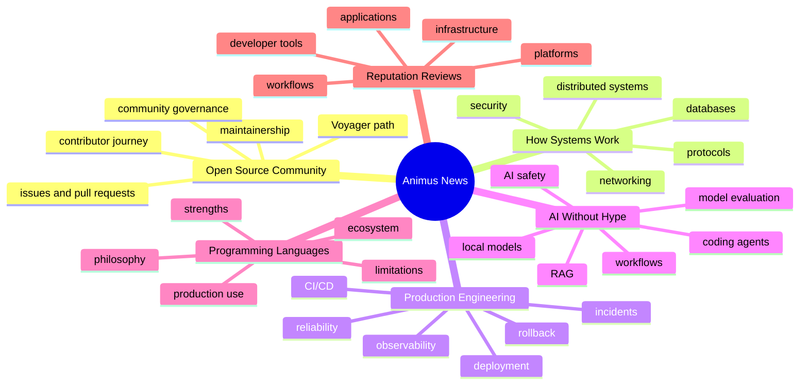
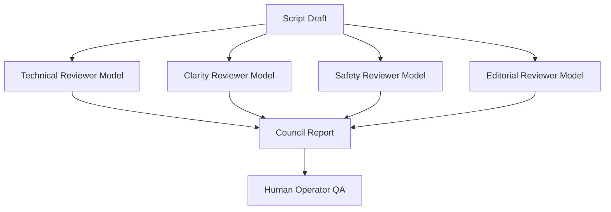

# Editorial Standard

## 1. Mission

Animus News creates educational IT media that explains how technology, engineering systems, open-source communities, and production workflows actually work.

The editorial goal is not virality at any cost. The goal is durable trust.

## 2. Audience

Primary audience:

- beginner and intermediate engineers;
- open-source newcomers;
- technically curious builders;
- community members who want a clear path into contribution.

Secondary audience:

- senior engineers who value accurate explanations;
- technical founders;
- maintainers;
- technical educators;
- product-minded developers.

## 3. Editorial promise

Every episode should answer:

1. What is this?
2. Why does it matter?
3. How does it work?
4. Where is it strong?
5. Where does it fail?
6. How should a thoughtful engineer use or understand it?
7. How does this connect to open-source practice and the Animus community?

## 4. Voice

Animus News should be:

- precise;
- calm;
- curious;
- technically honest;
- visually clear;
- respectful to the viewer;
- skeptical of hype;
- generous to newcomers;
- rigorous enough for experienced engineers.

It should not be:

- sensationalist;
- cynical;
- condescending;
- shallow;
- engagement-bait-driven;
- artificially controversial;
- blindly promotional;
- model-generated without editorial judgment.

## 5. Mascot role

The mascot is a guide, not a gimmick.

Recommended identity:

> A technical explorer who travels through systems, networks, codebases, production pipelines, and open-source communities, explaining what is happening and why it matters.

Mascot modes:

| Mode | Use case | Tone |
|---|---|---|
| Field Guide | open-source/community episodes | warm, orienting, encouraging |
| Explainer | networking, languages, architecture | clear, patient, structured |
| Production Mode | CI/CD, incidents, observability | practical, serious, calm |
| Lab Mode | AI/tools reviews | experimental, skeptical, curious |
| Mythbuster | hype correction | direct, evidence-based, slightly ironic |

Mascot must never:

- imitate a real person without permission;
- make unsupported claims;
- overpromise outcomes;
- mock beginners;
- become more important than the explanation;
- turn serious technical content into low-trust comedy.

## 6. Content pillars

## 7. Core formats

### 7.1 How It Works

Purpose: explain a technical system from first principles.

Structure:

1. Hook.
2. Problem.
3. Mental model.
4. Step-by-step mechanism.
5. Production reality.
6. Common mistakes.
7. Practical takeaway.
8. Community CTA.

Examples:

- What happens after `git push`?
- How DNS resolution works.
- How CI/CD gets code into production.
- How observability helps during incidents.

### 7.2 Portrait of a Technology

Purpose: explain a language, framework, database, protocol, or tool through its design philosophy.

Structure:

1. Why it exists.
2. What problem it tries to solve.
3. How it thinks.
4. Where it is strong.
5. Where it is weak.
6. Common mistakes.
7. Production usage.
8. How to learn it well.
9. Honest conclusion.

### 7.3 Production Notes

Purpose: teach real-world engineering practices.

Structure:

1. Production problem.
2. Why naive solutions fail.
3. Operational model.
4. Practical workflow.
5. Failure modes.
6. Recovery strategy.
7. Checklist.

### 7.4 AI Without Hype

Purpose: evaluate AI tools and techniques with engineering discipline.

Structure:

1. What it claims to do.
2. What it actually does.
3. Where it helps.
4. Where it fails.
5. Risks and safety.
6. Workflow integration.
7. Final verdict.

### 7.5 Reputation Review

Purpose: explain why a respected application, platform, or tool has earned trust.

Structure:

1. What it is.
2. Why professionals use it.
3. What it does exceptionally well.
4. Where it has limitations.
5. What trade-offs it makes.
6. Who should use it.
7. Who should not.
8. Practical conclusion.

### 7.6 Voyager Path

Purpose: guide people into the Animus open-source community.

Structure:

1. Identity and context.
2. What problem the community solves.
3. How newcomers can participate.
4. What good contribution looks like.
5. How reputation and responsibility grow.
6. First concrete action.

## 8. Script quality bar

A script is acceptable only if it has:

- a clear hook in the first 5-10 seconds;
- a specific promise;
- source-grounded claims;
- a logical progression;
- visualizable scenes;
- concrete examples;
- honest limitations;
- no unsupported superlatives;
- no shallow hype;
- a clear viewer takeaway;
- a relevant community CTA.

## 9. Prohibited editorial patterns

Do not publish:

- AI-generated summaries of other people's content without meaningful transformation;
- fake comparisons designed only to provoke comments;
- ranking lists without criteria;
- synthetic interviews or fake quotes;
- misleading thumbnails;
- exaggerated claims like “X is dead” unless heavily qualified and sourced;
- technical advice without context;
- security-sensitive tutorials that enable abuse;
- claims based solely on model memory.

## 10. Source rules

Preferred source hierarchy:

1. official documentation;
2. source code;
3. standards / RFCs / specifications;
4. release notes and changelogs;
5. maintainer statements;
6. respected engineering blogs and books;
7. community discussions as signal, not authority.

Every high-risk factual claim must be tied to primary or high-trust secondary sources.

## 11. Multimodel editorial review

Major episodes should be reviewed by a model panel before human QA.

The council report should include:

- approvals;
- objections;
- dissenting reasoning;
- unresolved risks;
- suggested revisions;
- confidence scores;
- final recommendation.

## 12. Call to action strategy

CTA should match the viewer's readiness.

| Stage | CTA |
|---|---|
| Awareness | Subscribe, watch next explainer |
| Learning | Read the transcript, inspect sources |
| Community interest | Join discussion, ask a question |
| Contribution | Open a good issue, pick a beginner task |
| Commitment | Join a working group / Voyager path |

CTA must be honest and relevant to the episode.

## 13. Editorial north star

Animus News should feel like a strong engineer explaining complex systems to a motivated newcomer with respect, precision, and imagination.
