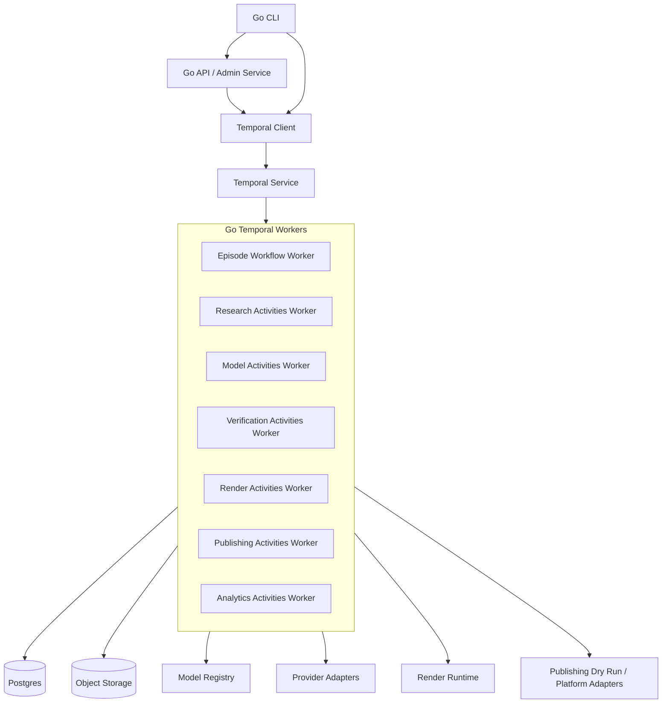
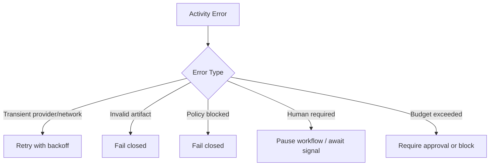
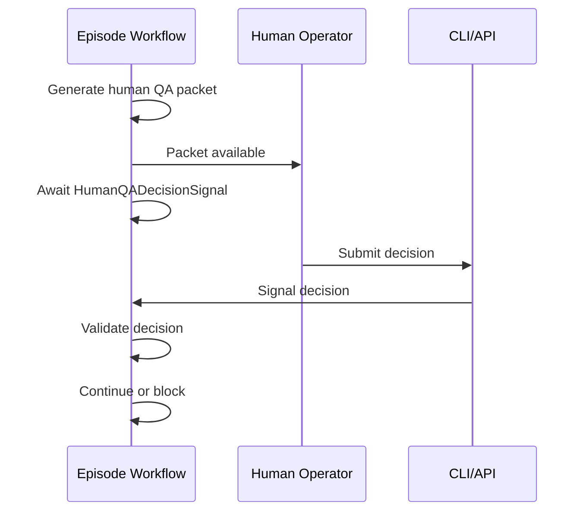

# Go + Temporal Implementation Plan

> **Status: target design, not current implementation.** This document describes
> the intended target architecture and stack. For authoritative, code-backed
> status see [`PRODUCTION_READINESS.md`](PRODUCTION_READINESS.md). **Implemented
> today:** the short-form (M1–L2) typed-contract / gate / `ShortFormWorkflow`
> slice running end-to-end on mock and fail-closed (disabled-by-default)
> providers — no live calls, no spend, no public publishing.

## 1. Purpose

This document supersedes any earlier TypeScript-oriented implementation assumptions for the Animus News backend and production orchestration layer.

The canonical production implementation is:

- **Go / Golang** for backend services, CLIs, artifact contracts, model adapters, verification, publishing adapters, analytics adapters, and production workers.
- **Temporal** for durable workflow orchestration, long-running episode lifecycle state, retries, human-in-the-loop waits, provider fallback, and replayable production execution.

TypeScript may still be used later for a frontend/editorial console, Remotion-specific rendering code, or isolated UI tooling, but not as the default backend implementation stack.

## 2. Why Go

Go is the preferred backend language for this project because Animus News needs:

- small, explicit interfaces;
- strong compile-time contracts;
- reliable concurrency primitives;
- simple deployment binaries;
- predictable operational behavior;
- excellent fit for worker-based systems;
- strong ecosystem support for Temporal workers;
- clean provider adapter boundaries;
- maintainable production services.

## 3. Why Temporal

Animus News is naturally a long-running, stateful, failure-prone workflow system:

- source ingestion can fail;
- model providers can timeout;
- multimodel councils may disagree;
- human QA may wait hours or days;
- rendering may fail and retry;
- publishing must be staged;
- analytics arrives later;
- corrections may reopen a published episode.

Temporal is a strong fit because it provides durable workflow execution, persisted workflow state, retries, task queues, timers, signals, and visibility into workflow executions.

## 4. Canonical architecture



## 5. Workflow and activity split

Temporal workflows must remain deterministic. Any nondeterministic or side-effecting operation must be implemented as an activity.

```mermaid
flowchart TD
  W[Temporal Workflow: EpisodeLifecycleWorkflow]
  W --> A1[Activity: ValidateArtifacts]
  W --> A2[Activity: BuildResearchPack]
  W --> A3[Activity: ExtractClaims]
  W --> A4[Activity: RunModelCouncil]
  W --> A5[Activity: GenerateHumanQAPacket]
  W --> S1[Wait: Human QA Signal]
  W --> A6[Activity: GenerateStoryboard]
  W --> A7[Activity: RenderPreview]
  W --> A8[Activity: RunProductionQA]
  W --> A9[Activity: GeneratePublishPack]
  W --> S2[Wait: Release Approval Signal]
  W --> A10[Activity: DryRunPublish]
  W --> A11[Activity: ImportAnalytics]
  W --> A12[Activity: GenerateAnalyticsInsights]
```



### Workflow code may contain

- deterministic branching;
- Temporal timers;
- Temporal signals/queries/updates;
- activity scheduling;
- retry policy selection;
- workflow state transitions;
- immutable references to artifact IDs and hashes.

### Workflow code must not contain

- network calls;
- model provider calls;
- filesystem mutation;
- rendering execution;
- publishing execution;
- direct wall-clock calls;
- randomness;
- non-deterministic map iteration;
- unbounded goroutine usage;
- direct secret access.

## 6. Main workflow

Canonical first workflow:

```text
EpisodeLifecycleWorkflow
```

Responsibilities:

1. Validate initial topic artifact.
2. Build research pack.
3. Extract claims.
4. Verify claims through multimodel council.
5. Generate human QA packet.
6. Wait for human QA signal.
7. Generate storyboard.
8. Produce render/preview.
9. Run production QA.
10. Generate publish pack.
11. Wait for release approval signal.
12. Run dry-run publishing adapter.
13. Import analytics fixture or provider data.
14. Generate analytics insights.
15. Close workflow with final episode report.

## 7. Signals and queries

### Signals

```go
HumanQADecisionSignal
ReleaseApprovalSignal
BlockEpisodeSignal
RequestRevisionSignal
AttachCorrectionSignal
```

### Queries

```go
GetEpisodeStateQuery
GetCurrentArtifactsQuery
GetBlockingIssuesQuery
GetCouncilStatusQuery
GetCostSummaryQuery
```

## 8. Activity groups

### Artifact activities

- `ValidateArtifactActivity`
- `ValidateEpisodeDirectoryActivity`
- `WriteArtifactActivity`
- `ReadArtifactActivity`
- `HashArtifactActivity`

### Research activities

- `BuildResearchPackActivity`
- `RankSourcesActivity`
- `NormalizeSourceActivity`

### Claim activities

- `ExtractClaimsActivity`
- `LinkClaimsToSourcesActivity`
- `ValidateClaimCoverageActivity`

### Model activities

- `RouteModelTaskActivity`
- `RunModelProviderActivity`
- `RunModelCouncilActivity`
- `GenerateCouncilReportActivity`

### QA activities

- `GenerateHumanQAPacketActivity`
- `ValidateHumanQADecisionActivity`
- `RunProductionQAActivity`

### Production activities

- `GenerateStoryboardActivity`
- `RenderPreviewActivity`
- `GenerateRenderManifestActivity`

### Publishing activities

- `GeneratePublishPackActivity`
- `ValidatePublishManifestActivity`
- `DryRunPublishActivity`

### Analytics activities

- `ImportAnalyticsActivity`
- `GenerateAnalyticsInsightsActivity`

### Security activities

- `ScanSecretsActivity`
- `RedactSensitiveTextActivity`
- `ValidateAssetProvenanceActivity`

## 9. Go package layout

Recommended initial layout:

```text
cmd/animus-news/
  main.go

internal/artifacts/
internal/schemas/
internal/sources/
internal/models/
  registry/
  router/
  adapters/
  mock/
internal/council/
internal/verification/
internal/workflows/
internal/activities/
internal/storyboard/
internal/render/
internal/publishing/
internal/analytics/
internal/audit/
internal/security/
internal/cost/
internal/config/

pkg/api/
  types.go
```

Rules:

- `internal/workflows` contains deterministic workflow code only.
- `internal/activities` may call internal packages and perform side effects.
- `internal/models/adapters` contains provider-specific implementations behind interfaces.
- `internal/models/mock` is used for local tests and dry runs.
- `cmd/animus-news` exposes CLI commands.

## 10. CLI commands

Initial CLI should expose:

```bash
animus-news validate <path>
animus-news validate-episode <episode-dir>
animus-news dry-run <episode-dir>
animus-news worker --task-queue <name>
animus-news start-workflow <episode-dir>
animus-news signal-human-qa <workflow-id> <decision-file>
animus-news query-state <workflow-id>
```

MVP can implement `validate`, `validate-episode`, and `dry-run` before full Temporal service integration.

## 11. Temporal task queues

Recommended task queues:

```text
animus-news-episode
animus-news-research
animus-news-models
animus-news-render
animus-news-publishing
animus-news-analytics
```

MVP may use a single local task queue, but code should not assume only one queue forever.

## 12. Retry policy guidance

Activities should define explicit retry behavior.



Recommended examples:

- model provider timeout: retry with bounded exponential backoff;
- invalid schema: no retry;
- unsupported high-risk claim: no retry, request revision;
- render worker crash: retry if idempotent;
- publishing dry-run failure: retry if transient, fail closed if policy/visibility issue.

## 13. Idempotency requirements

Activities must be idempotent where possible.

Artifact-producing activities should:

- write content-addressed artifacts;
- avoid overwriting approved artifacts;
- record dependency hashes;
- return artifact IDs and hashes;
- make repeated execution safe.

Provider activities should:

- use request IDs where providers support them;
- persist normalized responses;
- avoid duplicate irreversible operations;
- never perform public publishing in MVP.

## 14. Human-in-the-loop model

Human QA and release approval are represented as workflow waits.



Human decision must not be simulated by model approval.

## 15. Testing strategy

Required test layers:

- Go unit tests for schemas, routing, verification, QA, security;
- Temporal workflow tests using the Go SDK test environment;
- activity tests with mock providers;
- dry-run integration tests with no network;
- secret scanner tests with fake fixtures;
- replay/determinism tests for workflows where practical.

Expected commands:

```bash
go test ./...
go test -race ./...
go vet ./...
go fmt ./...
```

## 16. Revised Codex task baseline

Any task pack that references TypeScript, pnpm, Zod, Vitest, or Node.js as backend defaults must be interpreted as requiring Go equivalents:

| Previous TypeScript assumption | Go/Temporal replacement |
|---|---|
| `package.json` | `go.mod`, `go.sum`, `Makefile` or `Taskfile.yml` |
| `pnpm test` | `go test ./...` |
| `pnpm typecheck` | `go test ./...` + `go vet ./...` |
| Zod schemas | Go structs + validation + optional JSON Schema generation |
| Vitest | Go testing package |
| Commander CLI | Cobra, urfave/cli, or standard library CLI |
| Node scripts | Go commands under `cmd/` |
| mock providers in TS | Go mock adapters |
| validation CLI in TS | Go CLI |

## 17. First corrected implementation order

1. Go module/tooling baseline.
2. Go artifact structs and validators.
3. Go CLI for validation and dry run.
4. Pilot episode fixtures.
5. Model registry and router in Go.
6. Mock model providers in Go.
7. Multimodel council in Go.
8. Claim verification in Go.
9. Temporal workflow skeleton.
10. Activities for each artifact stage.
11. End-to-end dry run without real providers.
12. Temporal local integration test.

## 18. Production readiness definition

The system is production-ready only when:

- workflow execution is durable;
- activities are idempotent or explicitly compensating;
- model provider failures have fallback behavior;
- human QA and release approvals are enforced by workflow state;
- every artifact validates;
- every critical transition is audited;
- dry-run publishing cannot become public accidentally;
- test suite covers happy path, blocked path, retries, and human-in-the-loop waits.
