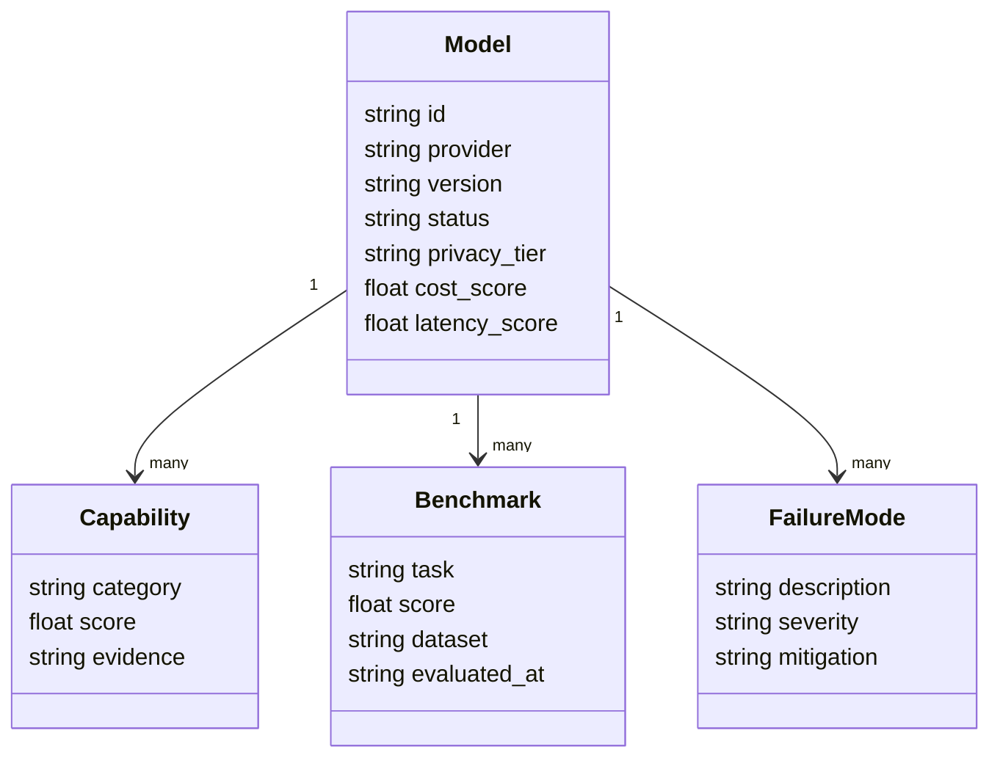
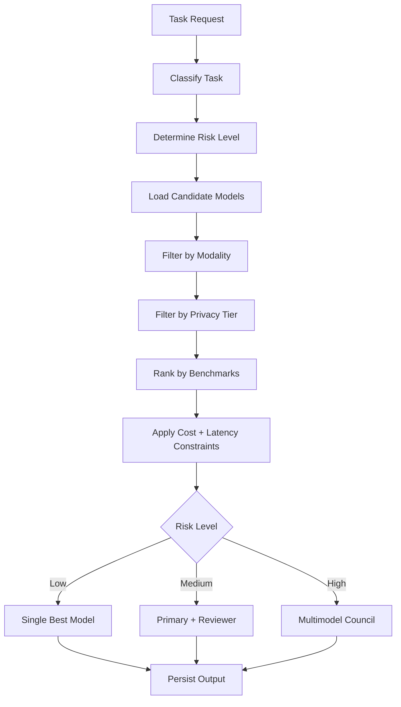
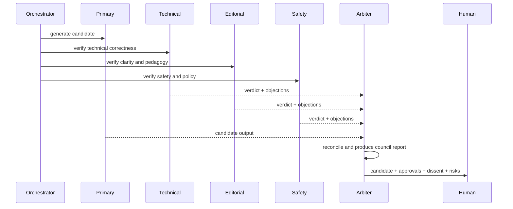
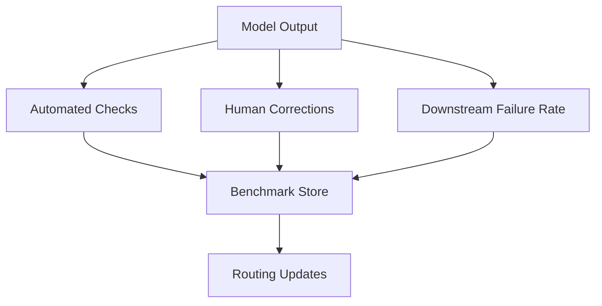
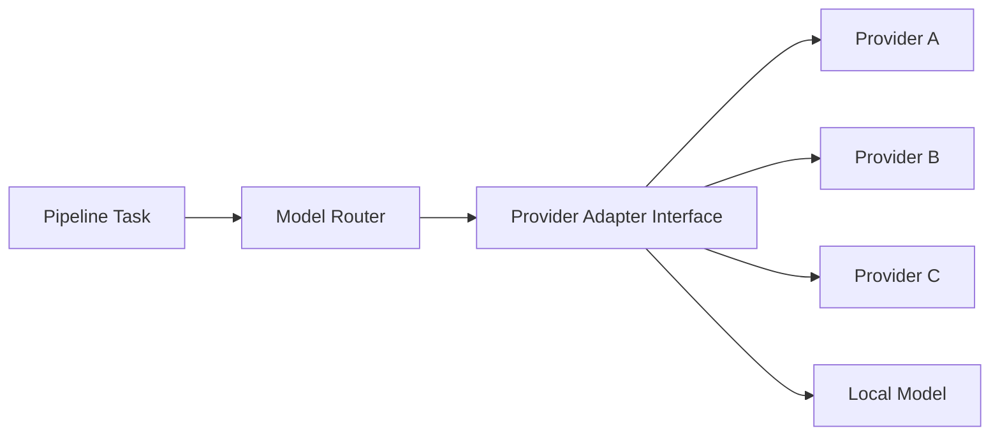
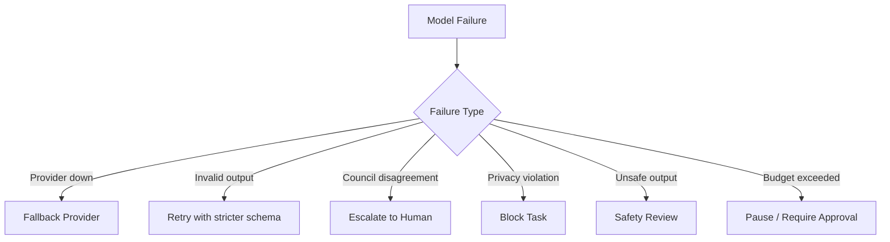

# Multimodel Strategy

## 1. Purpose

Animus News must never depend on a single neural network, model family, or provider as the universal source of judgment.

The project uses multimodel intelligence to improve technical accuracy, reduce single-model bias, support task specialization, and preserve long-term independence as model capabilities evolve.

## 2. Core idea

Different models are best at different things.

Animus News should use the best available model or model panel for each task category:

- research synthesis;
- source extraction;
- claim extraction;
- technical verification;
- code and diagram generation;
- editorial writing;
- language refinement;
- visual reasoning;
- storyboard planning;
- safety and policy review;
- analytics interpretation;
- TTS and voice generation;
- image and video generation where appropriate.

No model's output is automatically authoritative.

## 3. Model registry

The model registry is the control plane for model selection.



Each model entry should include:

```yaml
model_id: "provider.model.version"
provider: "provider-name"
version: "model-version"
modalities:
  - text
  - vision
  - audio
context_window: 0
privacy_tier: "public | internal-approved | restricted"
status: "active | degraded | disabled"
strengths:
  - technical_reasoning
  - code
  - editorial_quality
weaknesses:
  - weak_citations
  - high_latency
  - inconsistent_json
cost:
  input_unit: 0
  output_unit: 0
latency:
  p50_ms: 0
  p95_ms: 0
benchmarks: []
known_failure_modes: []
```

## 4. Task routing



Routing dimensions:

- task type;
- risk level;
- required modality;
- language;
- context length;
- structured output reliability;
- provider health;
- cost budget;
- latency budget;
- privacy policy;
- historical quality;
- human correction rate.

## 5. Council pattern

Critical artifacts require council review.



Council outputs:

- approved candidate;
- list of approving models;
- list of dissenting models;
- unresolved issues;
- risk assessment;
- confidence score;
- suggested revisions;
- final recommendation.

## 6. Approval policies

| Risk | Example | Policy |
|---|---|---|
| Low | grammar improvement | best single model |
| Medium | storyboard clarity | primary + reviewer |
| High | technical claims | multimodel council + human QA |
| Critical | security content / public release | council + required human approval |

## 7. Avoiding totalitarian model opinion

The system must actively avoid a single dominant model shaping all content.

Controls:

- separate writer and verifier models;
- rotate reviewer models by task;
- track dissent rather than suppress it;
- preserve minority objections in reports;
- benchmark models continuously;
- compare model families where possible;
- require source evidence over model confidence;
- allow human override with recorded rationale;
- never allow self-approval by the same model that generated the artifact.

## 8. Model benchmarking

Each model should be evaluated on project-specific tasks:

- source extraction accuracy;
- claim extraction recall;
- false positive rate in verification;
- ability to identify unsupported claims;
- script structure quality;
- clarity for beginners;
- technical precision for experts;
- JSON/schema reliability;
- visual reasoning quality;
- cost per accepted artifact;
- human correction rate.



## 9. Provider independence

Provider-specific code must be isolated behind adapters.



Adapter responsibilities:

- request formatting;
- response normalization;
- structured output validation;
- retries;
- provider-specific safety metadata;
- cost tracking;
- latency tracking;
- error mapping.

## 10. Privacy controls

Before a task is routed to a model, the router must check:

- data classification;
- provider privacy tier;
- user/community consent where applicable;
- whether sensitive data is present;
- whether redaction is required;
- whether local model execution is required.

Restricted data must not be sent to general external models.

## 11. Failure handling

Failure cases:

- provider unavailable;
- model degraded;
- model output invalid;
- council disagreement;
- cost budget exceeded;
- privacy rule violation;
- hallucination detected;
- unsafe output detected.

Handling:



## 12. Human operator interface

The operator should not receive raw chaos. The operator should receive a decision packet:

```yaml
artifact: "script.md"
status: "ready_for_human_qa"
summary: "Episode explains git push to production pipeline."
models:
  approvals: 3
  objections: 1
  blocked: 0
risks:
  - "One simplification around deployment strategies was revised."
required_human_checks:
  - "Confirm community CTA."
  - "Confirm title tone."
recommendation: "approve_with_minor_edits"
```

## 13. Non-goals

The multimodel layer is not meant to:

- replace human accountability;
- generate artificial consensus;
- increase cost without quality gain;
- route sensitive data indiscriminately;
- chase every new model without evaluation;
- let models vote on brand values without human direction.

## 14. Definition of success

The multimodel system succeeds when:

- better models can be adopted without architectural rewrite;
- poor-performing models can be disabled safely;
- critical artifacts receive diverse review;
- human QA receives clearer decision support;
- model disagreement improves quality rather than blocking everything;
- source evidence beats model confidence;
- the project remains independent from any single provider.
