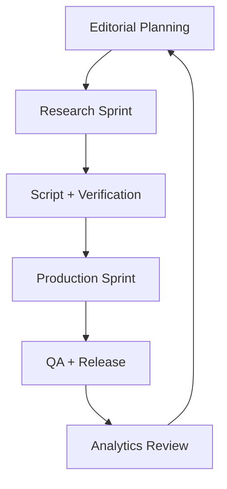
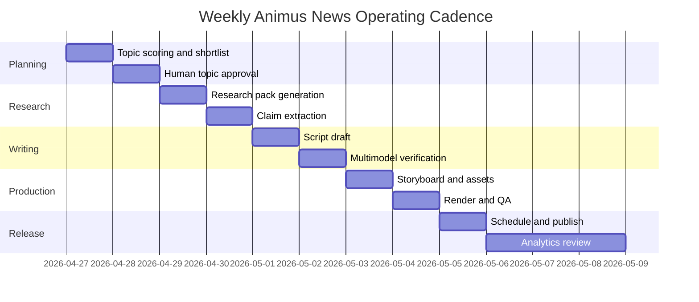
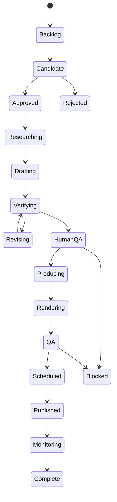
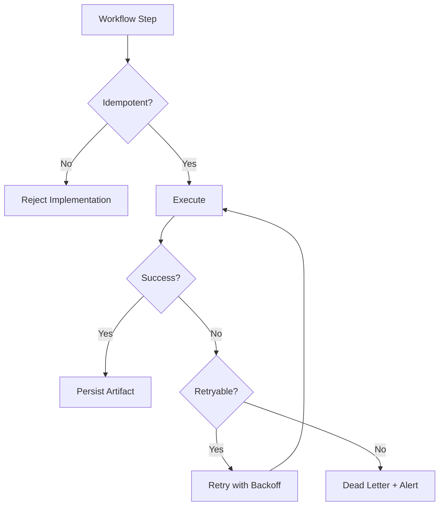
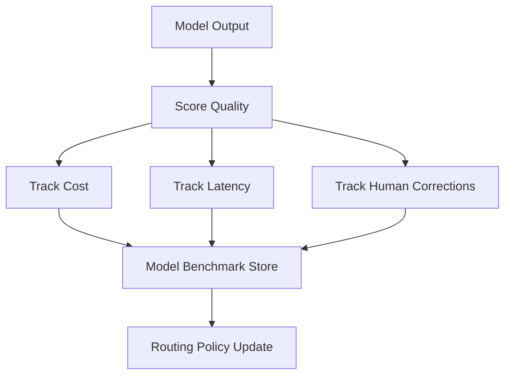
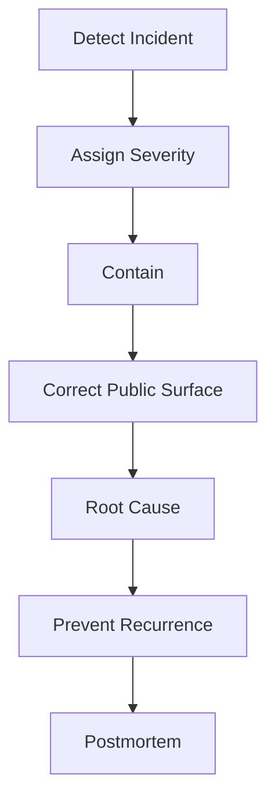

# Operations

## 1. Purpose

This document defines how Animus News should be operated as a production system: workflows, roles, reliability, observability, cost control, release management, incident response, and continuous improvement.

## 2. Operating model

Animus News should operate as an editorial-engineering system.

## 3. Roles

| Role | Responsibility |
|---|---|
| Editor-in-Chief | final content direction and release approval |
| Technical Verifier | correctness of technical claims |
| Model Council Arbiter | reconciles multimodel approvals and dissent |
| Production Engineer | rendering, assets, automation, publishing pipeline |
| Safety Reviewer | policy, synthetic media, abuse, privacy, licensing |
| Community Lead | CTA alignment, feedback, contributor journey |
| Analytics Reviewer | post-release metrics and recommendations |

One person may hold multiple roles in MVP, but production workflows should keep responsibilities explicit.

## 4. Weekly operating cadence

## 5. Workflow states

## 6. Observability

The system must emit logs, metrics, traces, and audit events.

### Metrics

- topic candidates generated;
- research packs completed;
- claim count per episode;
- unsupported claim count;
- model council disagreement rate;
- human QA rejection rate;
- render duration;
- render failure rate;
- cost per episode;
- publishing success rate;
- post-release correction rate;
- retention and CTR;
- community conversion.

### Logs

Logs must include:

- workflow ID;
- episode ID;
- artifact ID;
- model ID where applicable;
- provider;
- status;
- error class;
- retry count.

Do not log secrets, private tokens, raw credentials, or sensitive prompts.

## 7. Reliability

Production workflows should be durable and idempotent.

Required practices:

- idempotent workflow steps;
- resumable rendering;
- content-addressed asset cache;
- retry policies with limits;
- dead-letter queue for failed jobs;
- provider fallback;
- model timeout policy;
- artifact validation before stage transition;
- release freeze during critical incidents.

## 8. Cost control

Multimodel systems can become expensive. Cost must be tracked per episode, per stage, and per provider.

Controls:

- model routing by task complexity;
- cheap model for low-risk drafts;
- stronger model panels for high-risk gates;
- caching of source summaries;
- caching of embeddings;
- batch rendering;
- budget alerts;
- max cost per episode;
- provider fallback with cost awareness;
- no repeated council review unless upstream artifact changed.

## 9. Model operations

The model registry must support:

- model enable/disable;
- provider health status;
- task-specific benchmarks;
- cost/latency tracking;
- failure mode notes;
- regression testing;
- safety behavior notes;
- privacy tier configuration.

## 10. Release management

No generated output should go directly public.

Release steps:

1. render completed;
2. production QA passed;
3. metadata generated;
4. synthetic disclosure reviewed;
5. sources included where needed;
6. private upload completed;
7. final preview checked;
8. human release approval recorded;
9. scheduled publish.

## 11. Incident management

Incident severities:

| Severity | Meaning | Example |
|---|---|---|
| SEV-1 | public harm or private data exposure | leaked token in video |
| SEV-2 | serious factual or safety issue | wrong security guidance |
| SEV-3 | production defect | subtitle desync |
| SEV-4 | minor metadata issue | typo in description |

Response process:

## 12. Correction policy

When errors occur:

- minor wording issue: update description or pinned comment;
- factual clarification: pinned correction and description update;
- major misleading claim: unlist or replace video;
- private data exposure: remove immediately, rotate secrets, postmortem;
- unsafe guidance: remove or correct with explicit note.

## 13. MVP operating mode

MVP target:

- 1 long-form episode per week;
- 3-5 Shorts per long-form episode;
- semi-automated research and scripting;
- mandatory multimodel verification for scripts;
- human QA before storyboarding;
- manual or semi-automated scheduled publishing;
- analytics review after 72 hours.

## 14. Production operating mode

Production target:

- durable workflow orchestration;
- full artifact store;
- model registry and router;
- multimodel council automation;
- render workers;
- private upload automation;
- dashboard for QA and release;
- post-release analytics loop;
- incident and correction workflows.
