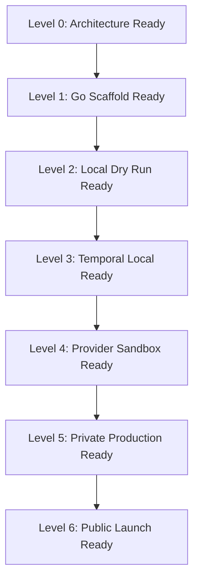

# Production Readiness Checklist

## Current repository status

The repository is now prepared for Go + Temporal production implementation. It includes:

- architecture documentation;
- Go module baseline;
- CLI skeleton;
- strict local episode validation;
- safe dry-run pipeline;
- model registry loader;
- model router;
- deterministic mock model providers;
- multimodel council runner;
- claim verification engine;
- Temporal workflow skeleton;
- Temporal activity stubs;
- Temporal workflow tests;
- Temporal worker command;
- Temporal operator CLI commands;
- pilot episode artifact bundle;
- CI workflow;
- Codex task packs and agent instructions.

The current implementation is a **production-start scaffold**, not a fully production-ready running news-generation platform. It is intentionally safe-by-default: no real model calls, no provider credentials, no uploads, and no public publishing.

## Launch readiness levels



## Level 0 — Architecture Ready

Complete when:

- system blueprint exists;
- multimodel strategy exists;
- security model exists;
- quality gates exist;
- artifact schemas are documented;
- Codex execution plan exists.

Status: complete.

## Level 1 — Go Scaffold Ready

Complete when:

- Go module exists;
- CLI entrypoint exists;
- core packages exist;
- basic tests exist;
- CI exists;
- pilot artifact bundle exists.

Status: substantially complete.

## Level 2 — Local Dry Run Ready

Complete when:

- `go test ./...` passes;
- `go run ./cmd/animus-news validate-episode episodes/0001-after-git-push` passes;
- `go run ./cmd/animus-news dry-run episodes/0001-after-git-push` passes;
- no network or secrets required;
- dry-run executes deterministic local model council;
- dry-run executes deterministic claim verification.

Status: implemented, pending verification in CI/Codex environment.

## Level 3 — Temporal Local Ready

Complete when:

- Temporal workflow tests pass with the Go SDK test environment;
- activities are registered and tested;
- workflow waits for human QA signal;
- workflow waits for release approval signal;
- invalid transitions block;
- replay/determinism constraints are documented and tested;
- local worker command exists;
- operator commands exist for start, signal, and query.

Status: implemented as a local scaffold, pending verification in CI/Codex environment and local Temporal service run.

## Level 4 — Provider Sandbox Ready

Complete when:

- model registry exists;
- mock providers exist;
- model router exists;
- multimodel council exists;
- claim verification uses mock providers;
- provider health and fallback policy exists;
- cost tracking exists.

Status: partially implemented. Provider health/fallback and cost tracking remain pending.

## Level 5 — Private Production Ready

Complete when:

- Postgres persistence exists;
- object storage exists;
- artifacts are immutable/versioned;
- provider credentials are managed through secrets;
- private/scheduled publishing adapter is implemented;
- production QA blocks unsafe release;
- audit logging is enforced;
- incident runbooks exist;
- private upload is possible but public release is gated.

Status: future implementation.

## Level 6 — Public Launch Ready

Complete when:

- real source ingestion is safe and provenance-preserving;
- real multimodel council is active;
- real human QA console or workflow is available;
- real rendering pipeline exists;
- real publishing dry-run and scheduled release are tested;
- security scanning passes;
- correction workflow is rehearsed;
- first episode passes final human editorial approval.

Status: future implementation.

## Non-negotiable launch blockers

The system must not publicly launch if any of these are true:

- any high-risk claim is unsupported;
- source locators are placeholders;
- human QA is missing;
- production QA is missing;
- publish manifest requests public visibility by default;
- secrets are present in artifacts/logs/descriptions;
- synthetic media disclosure is unresolved;
- provider-specific model code bypasses the router;
- Temporal workflow can publish without release approval;
- incident correction process is missing.

## Immediate next implementation sequence

1. Run CI/Codex checks and fix compile/test issues.
2. Implement provider health and fallback policy.
3. Implement cost tracking.
4. Implement security scanning and redaction utilities.
5. Implement publish pack generator.
6. Implement dry-run publishing adapter.
7. Implement source registry and research pack builder.
8. Implement real provider sandbox behind adapters.
9. Implement persistence and artifact store.
10. Implement operator UI/API.

## Required local verification commands

```bash
go test ./...
go vet ./...
go run ./cmd/animus-news validate-episode episodes/0001-after-git-push
go run ./cmd/animus-news dry-run episodes/0001-after-git-push
```

## Local Temporal operator loop

Run a local Temporal service first. Then, in one terminal, start the worker:

```bash
go run ./cmd/animus-news worker
```

In another terminal, start the pilot workflow:

```bash
go run ./cmd/animus-news start-workflow episode-0001 episodes/0001-after-git-push
```

Query workflow state:

```bash
go run ./cmd/animus-news query-state animus-news-episode-0001
```

Approve human QA for the dry run:

```bash
go run ./cmd/animus-news signal-human-qa animus-news-episode-0001 approve
```

Approve release for the dry run:

```bash
go run ./cmd/animus-news signal-release animus-news-episode-0001 approve
```

Query state again to confirm `dry_run_complete`:

```bash
go run ./cmd/animus-news query-state animus-news-episode-0001
```

This is still a dry-run path. It does not upload publicly and does not call real model providers.

## Current safety posture

Safe by default:

- no real provider calls;
- no credentials;
- no public publishing;
- pilot episode is draft/dry-run only;
- placeholder claims are not represented as production-approved;
- release approval is modeled as a workflow signal;
- invalid signal decisions are rejected locally before Temporal signaling.
