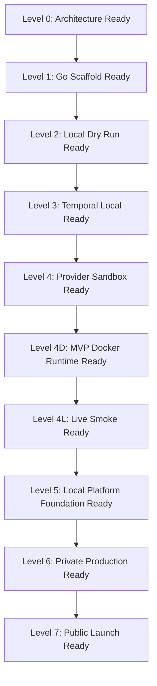

# Production Readiness Checklist

This document is the code-backed readiness view for `AnimusHQ/news` as it evolves into Animus Media Engine.

For the current north star and PLATFORM-001 scope, see [`PLATFORM_FOUNDATION.md`](PLATFORM_FOUNDATION.md).

## Current repository status

The repository is a **pre-production production foundation**, not a public media platform.

Implemented or merged checkpoints include:

- architecture documentation;
- Go module baseline;
- CLI skeleton and short-form pilot path;
- strict local episode validation;
- safe dry-run pipeline;
- model registry loader and router scaffold;
- deterministic mock providers;
- multimodel council runner;
- claim verification engine;
- Temporal workflow skeleton and local workflow tests;
- local real provider boundaries for FFmpeg, faster-whisper, Upload-Post dry-run, DaVinci MCP, OmniVoice, Claude review, external-command visual/voice;
- native Claude API review provider behind a live gate;
- Seedance and Chatterbox external-command wrapper boundaries;
- CFG-001 content-agnostic provider configuration;
- MVP-Docker-001 containerized local MVP runtime.

The default repo posture remains safe-by-default:

```text
no real provider calls in CI
no provider credentials in repo
no spend in verification targets
no generated media committed
no public publishing
no fake-live success
```

## Current readiness summary

| Area | Status |
| --- | --- |
| Typed artifacts / validation | Implemented for current short-form slice |
| Temporal local scaffold | Implemented as local scaffold |
| Provider boundaries | Implemented for current L2/MVP lanes, fail-closed |
| MVP Docker runtime | Implemented and merged |
| Live smoke MP4 | Next operator task |
| MinIO / S3 artifact store | PLATFORM-001 target |
| Keycloak auth | PLATFORM-001 target |
| Postgres metadata store | PLATFORM-001 target |
| Animus API / worker split | PLATFORM-001 target |
| OTIO timeline layer | PLATFORM-001 target |
| Multi-agent per-step model selection | Target; registry/router exists as scaffold, needs platform-level implementation |
| Public publishing | Explicitly out of scope |

## Readiness levels



## Level 0 — Architecture Ready

Complete when:

- system blueprint exists;
- multimodel strategy exists;
- security model exists;
- quality gates exist;
- artifact schemas are documented;
- Codex/operator execution plan exists.

Status: complete.

## Level 1 — Go Scaffold Ready

Complete when:

- Go module exists;
- CLI entrypoint exists;
- core packages exist;
- basic tests exist;
- CI exists;
- pilot artifact bundle exists.

Status: substantially complete.

## Level 2 — Local Dry Run Ready

Complete when:

- `go test ./...` passes;
- local validation passes;
- dry-run executes deterministic local model council;
- dry-run executes deterministic claim verification;
- no network or secrets required.

Status: implemented for the scaffold and current verification targets.

## Level 3 — Temporal Local Ready

Complete when:

- Temporal workflow tests pass with the Go SDK test environment;
- activities are registered and tested;
- workflow waits for human QA signal;
- workflow waits for release approval signal;
- invalid transitions block;
- replay/determinism constraints are documented and tested;
- local worker/operator commands exist.

Status: implemented as a local scaffold.

## Level 4 — Provider Sandbox Ready

Complete when:

- model registry exists;
- mock providers exist;
- model router exists;
- multimodel council exists;
- provider health/fallback policy exists;
- real provider boundaries fail closed when disabled or missing config;
- cost/risk metadata can be tracked.

Status: partially implemented. The L2 provider boundaries exist, but full model routing policy, cost tracking, and provider health/fallback remain platform tasks.

## Level 4D — MVP Docker Runtime Ready

Complete when:

- `docker-compose.mvp.yml` exists;
- `animus-news` container provides Go/Python/FFmpeg/ffprobe/wrappers;
- Chatterbox service is containerized and healthchecked;
- `.env.mvp.example` contains provider/service config only;
- runtime content enters via shell/CLI only;
- `make verify-mvp-docker` passes;
- generated outputs and local env files are gitignored.

Status: complete and merged.

## Level 4L — Live Smoke Ready

Complete when:

- clean clone can copy `.env.mvp.example` to `.env.mvp.local`;
- operator supplies real provider credentials;
- Chatterbox becomes healthy through Docker Compose;
- smoke run produces `episodes/mvp-smoke-001/dist/mvp-smoke-001-release-candidate.mp4`;
- or the command returns a precise classified blocker;
- no mock/fake provider counts as live success.

Status: next operator task.

## Level 5 — Local Platform Foundation Ready

Complete when PLATFORM-001 lands:

- Docker Compose boots Postgres, Temporal, MinIO, Keycloak, Animus API, Animus worker, Animus CLI, Chatterbox, and optional sidecars;
- MinIO buckets and service accounts are initialized;
- Keycloak realm, roles, clients, service accounts and local users are initialized;
- Postgres schema stores projects, episodes, workflow runs, agent runs, artifacts, object refs, reviews, releases, and timelines;
- Animus API validates Keycloak JWTs;
- workers run Temporal activities;
- artifacts/media are stored in MinIO and indexed in Postgres;
- model router supports Claude and OpenAI/ChatGPT lanes with per-step selection;
- OTIO timeline artifacts are generated or typed behind a stubbed interface;
- `make verify-platform-static` and `make verify-platform-compose` pass.

Status: future implementation.

## Level 6 — Private Production Ready

Complete when:

- real provider execution is stable behind live gates;
- release candidates are stored in object storage with metadata and hashes;
- Review Room or equivalent human QA workflow exists;
- private/dry-run publishing is authenticated and audited;
- incident/correction runbooks exist;
- production QA blocks unsafe release;
- audit logging is enforced.

Status: future implementation.

## Level 7 — Public Launch Ready

Complete when:

- public publishing is intentionally implemented;
- release approval requires authenticated human publisher role;
- real source ingestion is safe and provenance-preserving;
- analytics/correction workflow is rehearsed;
- platform-specific disclosure/policy requirements are resolved;
- first production episode passes final human editorial and release approval.

Status: future implementation.

## Non-negotiable blockers

The system must not claim production readiness if any of these are true:

- runtime content is stored in `.env` or provider config files;
- any high-risk claim is unsupported;
- source locators are placeholders;
- script exists without research/source state;
- render happens before validation/QA gates;
- provider output bypasses normalization, hashing, and validation;
- model output self-approves a critical artifact;
- model-specific code bypasses the router;
- Temporal workflow performs nondeterministic side effects directly;
- secrets appear in artifacts, logs, reports, Docker layers, or docs examples;
- generated media is committed;
- live provider calls happen in CI;
- public publishing can bypass human release approval;
- MVP/live run reports success without a validated target artifact.

## Immediate implementation sequence

1. Run **MVP-001 Live Smoke** from a clean clone and real `.env.mvp.local`.
2. If blocked, classify the exact blocker and fix only the blocking layer.
3. Run **MVP-001 Full Live**.
4. Start **PLATFORM-001**: Docker-bootstrapped Postgres, Temporal, MinIO, Keycloak, Animus API/worker, storage/auth/model-router/OTIO foundations.
5. Add CI-safe platform verification targets.
6. Add human review/release authorization path.
7. Add private production lane before public publishing.

## Required current verification commands

```bash
make verify
make verify-real-pilot
make verify-m2-local
make verify-m3
make verify-l2-providers
make verify-mvp-docker
go vet ./...
go test ./...
```

## Target platform verification commands

```bash
make verify-platform-static
make verify-platform-compose
make verify-auth-config
make verify-storage-config
make verify-agent-registry
make verify-otio
make verify-platform-local
```

Live smoke/full commands remain explicit operator actions and must require `ANIMUS_ALLOW_LIVE_PROVIDER_CALLS=1`.
