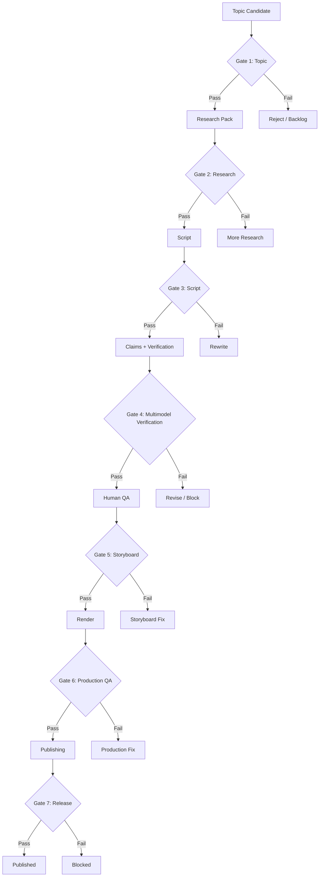
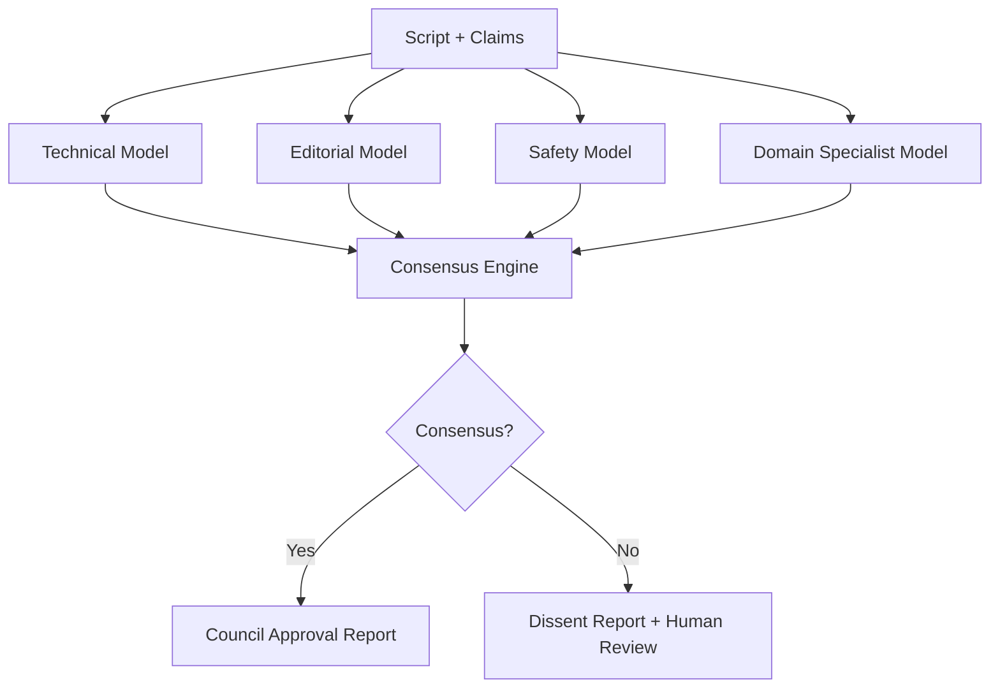
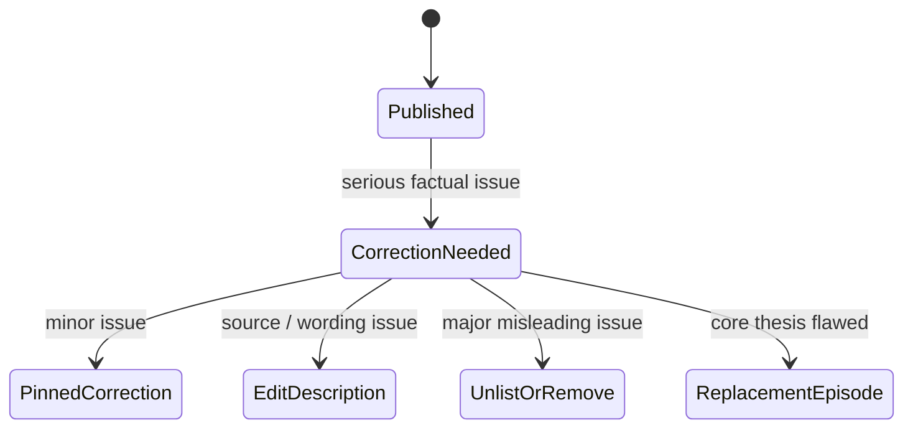

# Quality Gates

## 1. Purpose

Quality gates prevent the system from publishing technically weak, misleading, unsafe, low-effort, or poorly produced content.

The pipeline is allowed to be highly automated, but it must not be ungoverned.

## 2. Gate overview



## 3. Gate 1 — Topic approval

A topic passes only when it has:

- clear educational value;
- clear target audience;
- alignment with Animus community goals;
- sufficient source availability;
- visual explanation potential;
- realistic production cost;
- acceptable risk level.

Suggested scoring:

```text
pass if:
  educational_value >= 7
  community_fit >= 6
  source_availability >= 7
  factual_risk <= 6
  production_cost <= acceptable budget
```

## 4. Gate 2 — Research pack

A research pack passes only when it includes:

- primary or high-trust sources;
- source metadata and content hashes where possible;
- core claims;
- unresolved questions;
- terminology map;
- forbidden simplifications;
- known controversies;
- examples;
- recommended visual structures.

Fail conditions:

- no primary source for high-risk claims;
- source list is mostly low-quality blogs;
- research pack relies on model memory;
- unresolved contradictions are hidden;
- licensing status is unclear for reused assets.

## 5. Gate 3 — Script quality

A script passes only when it has:

- strong hook;
- explicit promise;
- accurate technical structure;
- no unsupported superlatives;
- no unverified numbers;
- no fake quotes;
- no misleading framing;
- concrete examples;
- clear viewer takeaway;
- appropriate CTA.

## 6. Gate 4 — Multimodel verification

Critical scripts must be reviewed by multiple models before human QA.



The council report must include:

- models used;
- task each model performed;
- approvals;
- objections;
- confidence scores;
- dissenting opinions;
- required revisions;
- final recommendation.

Fail conditions:

- high-risk unsupported claim;
- model disagreement on central thesis;
- safety model flags misleading or harmful content;
- technical reviewer identifies uncorrected factual error;
- model output cannot be traced to sources.

## 7. Gate 5 — Human operator QA

The human operator receives:

- research pack summary;
- script;
- claim risk report;
- multimodel approval report;
- dissent report;
- editorial checklist;
- recommended decision.

Human decisions:

- `approve`
- `approve_with_minor_edits`
- `request_revision`
- `block`

Only the human operator can approve final movement into storyboarding for high-risk or flagship episodes.

## 8. Gate 6 — Storyboard and asset quality

Storyboard passes only when:

- every scene has a purpose;
- visuals support comprehension;
- mascot actions do not distract;
- diagrams are correct;
- code snippets compile or are clearly illustrative;
- captions match narration;
- asset provenance is recorded.

Fail conditions:

- decorative visuals dominate explanation;
- AI-generated images misrepresent reality;
- mascot creates confusion;
- code examples are incorrect;
- diagrams contradict narration.

## 9. Gate 7 — Production QA

Rendered video passes only when:

- audio is clear;
- subtitles are synchronized;
- visual timing is readable;
- no broken assets;
- no hallucinated UI screenshots;
- no unlicensed material;
- no accidental private data exposure;
- no misleading thumbnail;
- no policy disclosure issue;
- export settings are correct.

## 10. Gate 8 — Release approval

Before publishing:

- title matches content;
- description includes sources where appropriate;
- disclosure settings are correct;
- CTA is accurate;
- thumbnail is not misleading;
- publish schedule is intentional;
- video is uploaded as private/scheduled first;
- final human release approval is recorded.

## 11. Gate 9 — Post-publication review

After publication, the system must collect:

- retention curve;
- CTR;
- comments;
- factual corrections;
- community conversion;
- viewer questions;
- production defects.

If a serious error is found:



## 12. Acceptance matrix

| Gate | Automation | Multimodel | Human required |
|---|---:|---:|---:|
| Topic | Yes | Advisory | Yes |
| Research | Yes | Optional | For high risk |
| Script | Yes | Yes | Yes |
| Claim verification | Yes | Yes | For unresolved claims |
| Storyboard | Yes | Optional | For flagship episodes |
| Production QA | Yes | Optional | Yes |
| Release | Partial | No | Yes |
| Post-publication correction | Yes | Advisory | Yes |
