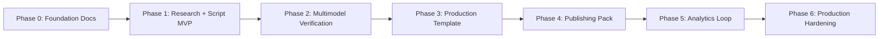
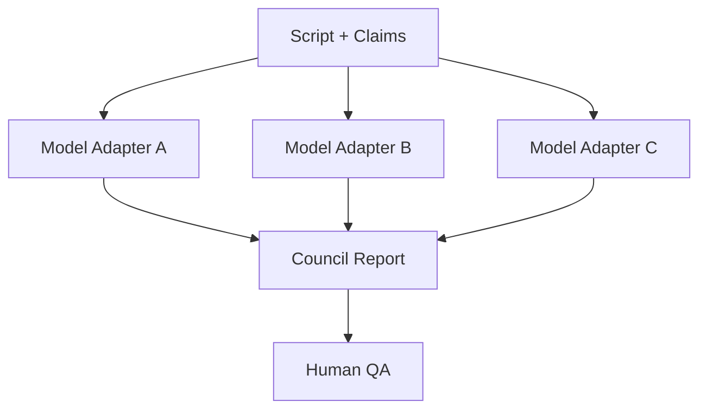

# Roadmap

## 1. Roadmap philosophy

Animus News should be built in phases. The correct order is not “connect every AI tool first.” The correct order is:

1. define editorial and artifact contracts;
2. prove research and verification quality;
3. prove repeatable production;
4. automate distribution;
5. close the analytics loop;
6. harden into a production platform.

## 2. Phase overview

## 3. Phase 0 — Foundation

Goal: define the system before building automation.

Deliverables:

- README;
- system blueprint;
- editorial standard;
- quality gates;
- security and safety model;
- schemas;
- operations guide;
- architecture decisions;
- contribution policy.

Exit criteria:

- every core artifact has a documented purpose;
- quality gates are defined;
- model independence is documented;
- human approval points are documented;
- first pilot topics are selected.

## 4. Phase 1 — Research + Script MVP

Goal: produce source-grounded scripts efficiently.

Deliverables:

- topic scoring script/service;
- research pack generator;
- source ranking rules;
- claim extractor;
- script template engine;
- first 3 script templates:
  - How It Works;
  - Portrait of a Technology;
  - AI Without Hype.

Exit criteria:

- generate a complete research pack for a pilot episode;
- extract claims from script;
- identify unsupported claims;
- operator can approve/reject topic and script.

## 5. Phase 2 — Multimodel Verification

Goal: make verification provider-independent and resistant to single-model bias.

Deliverables:

- model registry;
- model adapter interface;
- task router;
- model benchmark records;
- multimodel council workflow;
- dissent report;
- human QA view.

Exit criteria:

- at least 3 models can review the same script;
- approvals and dissent are persisted;
- unsupported claims block progression;
- model routing can be changed without rewriting pipeline logic.

## 6. Phase 3 — Production Template

Goal: render one repeatable high-quality video format.

Deliverables:

- mascot guide and visual states;
- Remotion or equivalent render template;
- diagram generation pipeline;
- subtitle generation;
- voice/TTS abstraction;
- asset manifest;
- render manifest;
- first long-form pilot render.

Exit criteria:

- one 6-10 minute episode can be rendered;
- subtitles are synced;
- diagrams are readable;
- asset provenance is recorded;
- production QA can approve or reject render.

## 7. Phase 4 — Publishing Pack

Goal: convert a long-form episode into a complete distribution bundle.

Deliverables:

- title candidates;
- thumbnail candidates;
- description generator;
- chapters generator;
- pinned comment draft;
- Shorts extraction;
- community post draft;
- private/scheduled upload workflow.

Exit criteria:

- one approved episode produces a full publish pack;
- no direct public publish exists;
- human release approval is required;
- generated metadata passes QA.

## 8. Phase 5 — Analytics Loop

Goal: use real performance data to improve without sacrificing trust.

Deliverables:

- metrics importer;
- retention analysis;
- comment mining;
- community conversion tracking;
- topic score updater;
- format performance reports;
- cost-per-episode dashboard.

Exit criteria:

- 24h, 72h, and 7d reports generated;
- future topic scoring uses real data;
- corrections can be triggered from feedback;
- analytics never bypass editorial gates.

## 9. Phase 6 — Production Hardening

Goal: make the system reliable, secure, and scalable.

Deliverables:

- durable workflow engine;
- artifact store;
- RBAC;
- audit logs;
- model provider health monitoring;
- retry and dead-letter policies;
- CI validation for schemas and docs;
- incident response automation;
- cost and budget enforcement;
- backup and recovery process.

Exit criteria:

- failed workflows can resume;
- all artifacts validate in CI;
- all approvals are auditable;
- provider failures have fallback behavior;
- incident response is documented and tested.

## 10. Pilot episode plan

Recommended first four episodes:

1. What happens after `git push`?
2. DNS: why opening a website is not simple.
3. Go: simplicity as an engineering strategy.
4. PostgreSQL: why production teams trust it.

Each pilot should produce:

- long-form video;
- 3-5 Shorts;
- transcript;
- source list;
- community post;
- analytics report.

## 11. Definition of done

The system is production-ready when:

- a complete episode can be generated through all gates;
- multiple models can review critical artifacts;
- human QA has clear decision support;
- rendering is repeatable;
- publication is staged;
- analytics feed topic selection;
- security and safety checks block unsafe releases;
- the project is no longer dependent on any single AI provider.
