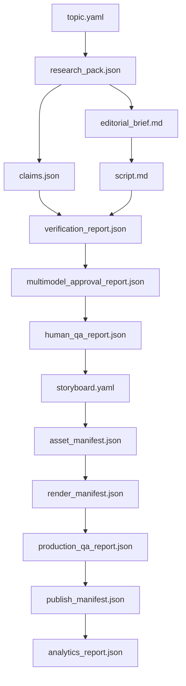

# Artifact Schemas

## 1. Purpose

Animus News is artifact-driven. Every stage of the pipeline must produce typed outputs that can be validated, versioned, replayed, audited, and reviewed by humans and models.

This document defines the canonical schemas conceptually. Production implementation should convert these into JSON Schema, Zod, Pydantic, or equivalent runtime validation contracts.

## 2. Artifact lifecycle



## 3. Common metadata

Every machine-readable artifact should include:

```yaml
schema_version: "1.0"
episode_id: "episode-0001"
artifact_id: "research-pack-episode-0001-v1"
created_at: "2026-04-28T00:00:00Z"
created_by: "system | human | model:<model_id>"
source_artifacts: []
content_hash: "sha256:..."
status: "draft | approved | rejected | superseded"
```

## 4. topic.yaml

```yaml
schema_version: "1.0"
episode_id: "episode-0001"
title_working: "What happens after git push?"
format: "how_it_works"
audience:
  primary: "beginner/intermediate engineers"
  secondary: "open-source contributors"
scores:
  educational_value: 9
  evergreen_value: 9
  community_fit: 8
  visual_potential: 10
  production_cost: 5
  factual_risk: 4
  funnel_value: 8
status: "approved"
operator_decision:
  by: "human"
  decision: "approve"
  notes: "Strong first pilot topic."
```

## 5. research_pack.json

```json
{
  "schema_version": "1.0",
  "episode_id": "episode-0001",
  "core_question": "What happens between git push and production deployment?",
  "learning_objectives": [
    "Explain remote repository update",
    "Explain CI checks",
    "Explain artifact build and deployment",
    "Explain rollback and monitoring"
  ],
  "sources": [
    {
      "source_id": "git-docs-001",
      "title": "Git documentation",
      "uri": "https://git-scm.com/doc",
      "trust_level": "primary",
      "content_hash": "sha256:...",
      "license_notes": "public documentation"
    }
  ],
  "required_terms": ["commit", "remote", "CI", "artifact", "deploy", "rollback"],
  "forbidden_simplifications": [
    "Do not imply CI/CD always uses Kubernetes.",
    "Do not imply deploy is just file upload."
  ],
  "visual_opportunities": [
    "pipeline diagram",
    "terminal animation",
    "rollback state transition"
  ]
}
```

## 6. claims.json

```json
{
  "schema_version": "1.0",
  "episode_id": "episode-0001",
  "claims": [
    {
      "claim_id": "claim-001",
      "text": "CI systems commonly run automated checks after repository events such as pushes or pull requests.",
      "type": "technical",
      "risk_level": "medium",
      "source_ids": ["github-actions-docs-001"],
      "evidence_locators": [
        {
          "source_id": "github-actions-docs-001",
          "section": "Events that trigger workflows",
          "range": "...",
          "quote_hash": "sha256:..."
        }
      ],
      "verification_status": "supported"
    }
  ]
}
```

## 7. verification_report.json

```json
{
  "schema_version": "1.0",
  "episode_id": "episode-0001",
  "summary": "All high-risk claims supported. Two medium-risk claims revised for precision.",
  "claim_results": [
    {
      "claim_id": "claim-001",
      "status": "supported",
      "notes": "Supported by official documentation."
    }
  ],
  "blocking_issues": [],
  "decision": "approved"
}
```

## 8. multimodel_approval_report.json

```json
{
  "schema_version": "1.0",
  "episode_id": "episode-0001",
  "model_panel": [
    {
      "model_id": "technical-reviewer-model",
      "provider": "provider-a",
      "task": "technical verification",
      "verdict": "approve",
      "confidence": 0.91,
      "notes": "Technically accurate after revisions."
    },
    {
      "model_id": "editorial-reviewer-model",
      "provider": "provider-b",
      "task": "clarity and structure",
      "verdict": "approve_with_suggestions",
      "confidence": 0.84,
      "notes": "Hook can be shorter."
    }
  ],
  "consensus": "approved",
  "dissent": [],
  "operator_summary": "Ready for human QA."
}
```

## 9. human_qa_report.json

```json
{
  "schema_version": "1.0",
  "episode_id": "episode-0001",
  "reviewer": "operator",
  "decision": "approve",
  "notes": "Proceed to storyboard.",
  "required_changes": []
}
```

## 10. storyboard.yaml

```yaml
schema_version: "1.0"
episode_id: "episode-0001"
scenes:
  - scene_id: "scene-001"
    time_target: "0:00-0:08"
    narration: "You typed git push. A few minutes later, code may be in production."
    mascot:
      mode: "Production Mode"
      emotion: "curious"
      action: "opens terminal"
    visual:
      type: "terminal_animation"
      content: "git push origin main"
    on_screen_text: "From commit to production"
```

## 11. asset_manifest.json

```json
{
  "schema_version": "1.0",
  "episode_id": "episode-0001",
  "assets": [
    {
      "asset_id": "voiceover-main",
      "type": "audio",
      "path": "assets/voiceover.wav",
      "generated_by": "tts:model-id",
      "license": "owned/generated",
      "hash": "sha256:..."
    },
    {
      "asset_id": "pipeline-diagram",
      "type": "svg",
      "path": "assets/pipeline.svg",
      "generated_by": "diagram-renderer",
      "license": "owned/generated",
      "hash": "sha256:..."
    }
  ]
}
```

## 12. render_manifest.json

```json
{
  "schema_version": "1.0",
  "episode_id": "episode-0001",
  "renderer": "remotion",
  "renderer_version": "x.y.z",
  "inputs": ["storyboard.yaml", "asset_manifest.json"],
  "outputs": [
    {
      "type": "youtube_16_9",
      "path": "dist/episode-0001.mp4",
      "duration_seconds": 520,
      "resolution": "1920x1080",
      "hash": "sha256:..."
    },
    {
      "type": "short_9_16",
      "path": "dist/episode-0001-short-01.mp4",
      "duration_seconds": 48,
      "resolution": "1080x1920",
      "hash": "sha256:..."
    }
  ]
}
```

## 13. production_qa_report.json

```json
{
  "schema_version": "1.0",
  "episode_id": "episode-0001",
  "checks": {
    "audio": "pass",
    "captions": "pass",
    "visuals": "pass",
    "claims": "pass",
    "asset_provenance": "pass",
    "policy": "pass"
  },
  "blocking_issues": [],
  "decision": "approved"
}
```

## 14. publish_manifest.json

```json
{
  "schema_version": "1.0",
  "episode_id": "episode-0001",
  "platform": "youtube",
  "visibility": "scheduled",
  "title": "What Happens After git push?",
  "description_path": "dist/description.md",
  "thumbnail_path": "dist/thumbnail.png",
  "scheduled_at": "2026-05-01T15:00:00Z",
  "human_release_approval": true
}
```

## 15. analytics_report.json

```json
{
  "schema_version": "1.0",
  "episode_id": "episode-0001",
  "window": "72h",
  "metrics": {
    "ctr": 0.0,
    "average_view_duration_seconds": 0,
    "first_30s_retention": 0.0,
    "subscriber_delta": 0,
    "community_clicks": 0
  },
  "insights": [],
  "recommended_actions": []
}
```

## 16. Validation policy

- Every artifact must validate against its schema before it can be consumed.
- Every artifact must list upstream dependencies.
- Every artifact must be content-hashed.
- Every approved artifact should be immutable; revisions create new versions.
- Every model-produced artifact must store model/provider metadata.
- Every high-risk artifact must have human approval metadata.
