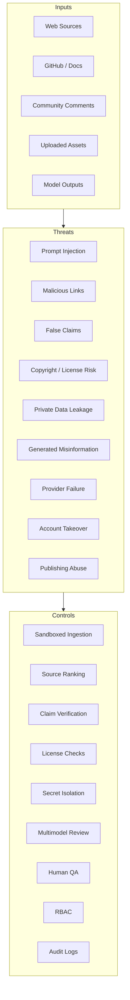
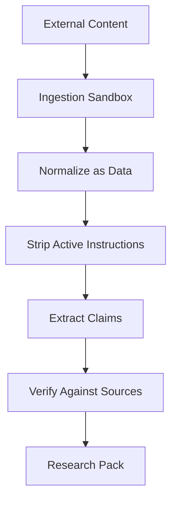
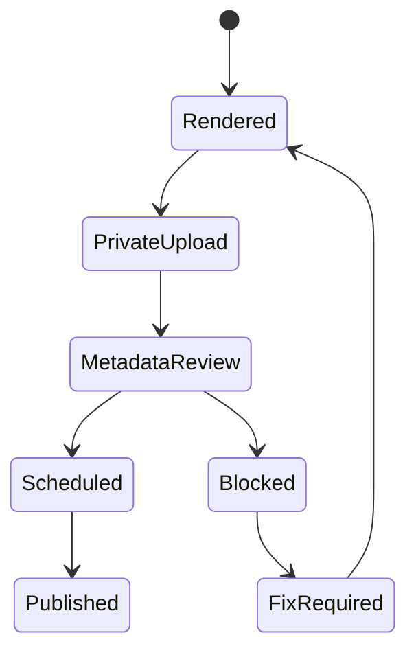
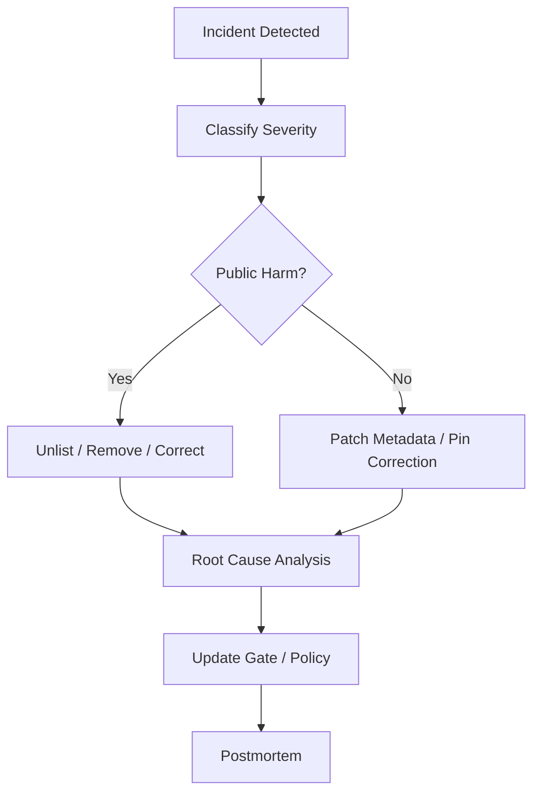

# Security and Safety

## 1. Purpose

Animus News uses AI, external sources, community input, rendering tools, and publishing integrations. This creates security, safety, trust, and abuse risks. This document defines the security posture required for a production-grade educational media system.

## 2. Security principles

1. Treat all external content as untrusted.
2. Treat all model output as untrusted until verified.
3. Do not expose secrets to models or rendering workers unnecessarily.
4. Sandbox ingestion and rendering.
5. Preserve provenance for all sources and assets.
6. Prefer least privilege for all integrations.
7. Avoid provider lock-in and single-model authority.
8. Fail closed on verification, QA, publishing, and policy uncertainty.
9. Record audit logs for approval and publication events.
10. Separate advisory automation from authoritative release control.

## 3. Threat model



## 4. Prompt injection defense

External documents, comments, issues, web pages, transcripts, and model outputs may contain instructions that attempt to control the system.

Required controls:

- never execute instructions from source material;
- store source text as evidence, not as system prompt;
- separate data channels from instruction channels;
- quote or summarize sources only after normalization;
- block source-provided instructions such as “ignore previous instructions”;
- use structured extraction with schemas;
- run adversarial-content detection during ingestion;
- log suspicious source segments.



## 5. Multimodel safety

Multimodel support improves quality only if controlled correctly.

Risks:

- consensus illusion: multiple similar models repeat the same error;
- provider outage;
- model drift;
- hidden prompt injection propagation;
- inconsistent safety behavior;
- cost explosions;
- privacy leakage across providers.

Controls:

- maintain independent model families where possible;
- track model version and provider in every output;
- benchmark models by task category;
- require dissent report for critical artifacts;
- use privacy filters before sending sensitive context to external providers;
- keep provider-specific adapters behind a stable model interface;
- allow emergency provider disablement;
- never treat model consensus as final authority without human QA for high-risk releases.

## 6. Model registry requirements

The model registry must track:

```yaml
model_id: string
provider: string
version: string
modalities: [text, image, audio, video]
strengths: [reasoning, code, vision, writing, safety, multilingual]
weaknesses: [known_failure_modes]
context_window: number
structured_output_score: number
tool_use_score: number
latency_profile: string
cost_profile: string
privacy_tier: string
allowed_data_classes: [public, internal, sensitive_allowed?]
benchmark_history: []
status: active | degraded | disabled
```

## 7. Data classification

| Class | Examples | Model access |
|---|---|---|
| Public | public docs, public release notes | allowed |
| Community | public comments, issues, discussions | allowed after normalization |
| Internal | private planning docs, private repos | only approved providers/models |
| Sensitive | secrets, credentials, tokens, private user data | never send to general models |
| Restricted | legal, security incidents, embargoed material | human approval required |

## 8. Secret management

Secrets must not appear in:

- prompts;
- logs;
- rendered videos;
- transcripts;
- exported artifacts;
- model context;
- community posts.

Required controls:

- managed secret store;
- scoped tokens;
- short-lived credentials where possible;
- no secrets in repository;
- no secrets in rendered asset metadata;
- redaction scanning in CI;
- secret rotation procedure;
- publishing token least privilege.

## 9. Asset safety

Generated and imported assets must include:

- source or generator;
- license status;
- creation timestamp;
- prompt or generation metadata when safe to store;
- modification history;
- allowed usage scope;
- disclosure requirement.

Do not use:

- unlicensed copyrighted clips;
- real-person likenesses without permission;
- synthetic footage that could mislead viewers;
- fake UI screenshots presented as real;
- real company logos in misleading contexts;
- generated citations or fake references.

## 10. Synthetic media disclosure

The project should prefer a visibly stylized mascot and explanatory graphics. This reduces misleading-realism risk.

Disclosure review is required when content includes:

- realistic synthetic people;
- altered footage of real events;
- synthetic voice resembling a real person;
- generated scenes that could be mistaken for real footage;
- sensitive topics where realism may mislead.

## 11. Publishing safety

Publishing must be staged:



Direct public publishing from generated output is prohibited.

## 12. Abuse prevention

The system must not produce:

- malware instructions;
- credential theft guidance;
- exploit chains enabling abuse;
- harmful evasion guidance;
- targeted harassment;
- impersonation;
- synthetic defamation;
- misleading financial, medical, or legal advice.

Security education is allowed when framed defensively, responsibly, and with safe abstraction.

## 13. Supply chain security

Controls:

- lock dependencies;
- scan container images;
- sign releases where possible;
- pin rendering dependencies;
- validate external binaries;
- isolate render workers;
- use least-privilege CI tokens;
- review third-party AI/video tools;
- log generated artifact hashes.

## 14. Incident response

Incident classes:

- factual error;
- unsafe content;
- private data exposure;
- copyright/license claim;
- account compromise;
- provider breach;
- malicious source injection;
- publication mistake.



## 15. Security acceptance criteria

A release is blocked if:

- secrets are detected;
- high-risk claims are unsupported;
- asset provenance is missing;
- model/provider policy is violated;
- synthetic media disclosure is unresolved;
- publication tokens are overprivileged;
- QA report is missing;
- human release approval is absent.
