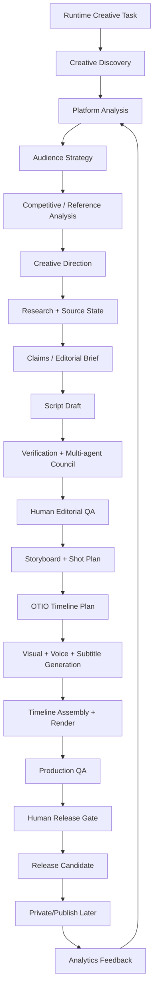
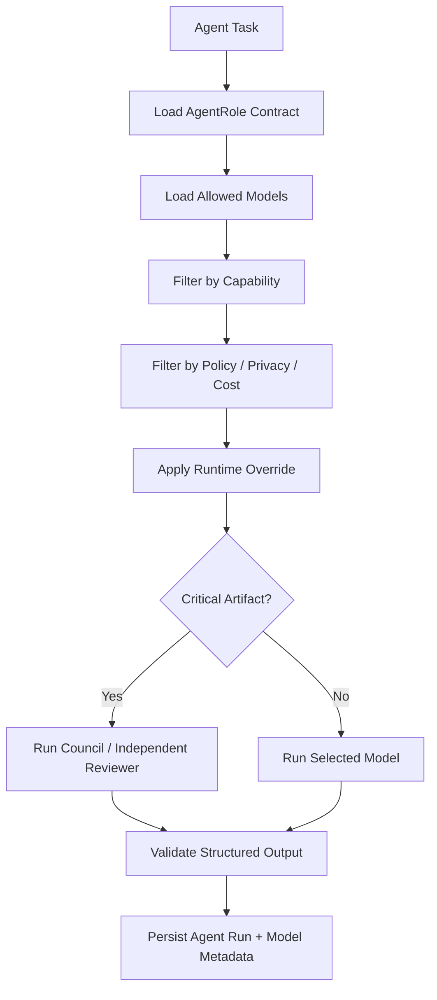

# Animus Media Engine System Blueprint

> Status: target design, not current implementation. For code-backed status, see [`PRODUCTION_READINESS.md`](PRODUCTION_READINESS.md). For the current platform-slice roadmap, see [`PLATFORM_FOUNDATION.md`](PLATFORM_FOUNDATION.md).

## 1. Purpose

Animus Media Engine is a production-grade, source-grounded, multi-agent media production system for creating high-quality short-form videos now and cinematic/film-scale productions later.

The first product lane is Animus News short-form media. The target system is broader: a platform-aware, topic-agnostic, style-adaptive AI production operating system.

The system is not an AI content farm. It is a **media compiler**: it transforms creative intent, platform strategy, source evidence, model-assisted reasoning, production assets, editorial review, timeline decisions, and release gates into validated media artifacts.

## 2. Non-negotiable principles

1. **No claim without source or source-state.**
2. **No script without research and creative strategy.**
3. **No final model monopoly.** Critical artifacts are reviewed by multiple agents/models and/or humans.
4. **No generated output self-approval.**
5. **No provider output trusted without validation, hashing, and provenance.**
6. **No render without verification and production gates.**
7. **No public publishing without authenticated human release approval.**
8. **No direct public upload path from generated output.**
9. **No provider lock-in.** Models and media providers are replaceable behind typed boundaries.
10. **No hardcoded topic, style, platform, format, voice, or CTA.** These are runtime creative decisions.
11. **No secrets in repo, logs, artifacts, Docker layers, or docs examples.**
12. **No fake-live success.** Live runs require live gates and validated target artifacts.
13. **Temporal workflows must remain deterministic.** Side effects belong in activities.
14. **Every episode must be replayable from typed artifacts, object refs, and timeline metadata.**
15. **Every optimization must preserve trust, safety, quality, and auditability.**

## 3. Architecture at a glance



## 4. Core platform stack

Canonical backend/runtime stack:

```text
Go
Temporal
Postgres
MinIO / S3-compatible object storage
Keycloak
Docker Compose for local platform bootstrap
OpenTimelineIO for editorial timeline interchange
TypeScript only for console/review room/render UI surfaces
```

Responsibilities:

| Layer | Responsibility |
| --- | --- |
| Go core | CLI, API, provider adapters, validators, gates, artifact handling, workflow activities |
| Temporal | durable workflows, retries, human waits, resume/replay, long-running jobs |
| Postgres | metadata, lineage, workflow status, artifact index, review/release decisions |
| MinIO | large artifact and media object storage |
| Keycloak | user/service identity, authorization, roles, release authority |
| OTIO | canonical timeline interchange and editorial structure |
| Docker | reproducible local infrastructure bootstrap |

## 5. Creative intelligence foundation

Production begins with analysis, not with a script.

Required pre-script stages:

```text
PlatformAnalysisStage
AudienceAnalysisStage
CompetitiveReferenceStage
FormatStrategyStage
CreativeDirectionStage
SuccessCriteriaStage
```

Required artifacts:

```text
platform_analysis_report.json
audience_strategy.json
competitive_reference_report.json
format_strategy.json
creative_direction.md
success_criteria.json
quality_benchmark.json
```

This layer keeps the project topic-agnostic and style-adaptive. Claude, ChatGPT/OpenAI, or future models may ask clarifying questions, infer strategy, compare formats, and define quality targets before script generation.

## 6. Multi-agent foundation

Animus Media Engine is model-agnostic and role-based.

Initial agent roles:

```text
Platform Analyst
Audience Strategist
Researcher
Fact Checker
Creative Director
Scriptwriter
Script Critic
Storyboard Director
Visual Prompt Engineer
Continuity Supervisor
Voice Director
Editor
Production QA
Release Reviewer
Analytics Analyst
```

Each role is defined by:

```text
AgentRole
TaskContract
AllowedModels
DefaultModel
SelectionPolicy
OutputSchema
ValidationGate
```

Model choices are runtime/config decisions, not hardcoded application assumptions.

## 7. Model registry and router

The Model Registry records:

- provider;
- model identifier;
- modality support;
- context length;
- structured output reliability;
- tool-use reliability;
- reasoning strength;
- creative strength;
- code strength;
- multilingual strength;
- safety behavior;
- latency;
- cost;
- privacy posture;
- supported deployment modes;
- benchmark history;
- known failure modes.

The Model Router selects one or more models per stage.



Hard rules:

- model choice is recorded in artifacts;
- critical artifacts cannot be approved only by the model that created them;
- council reports preserve dissent;
- fallback models cannot silently become final authority;
- every model output is schema-validated before use.

## 8. Canonical artifact graph

Existing short-form artifacts remain valid:

```text
topic.yaml
research_pack.json
claims.json
editorial_brief.md
script.md
verification_report.json
multimodel_approval_report.json
human_qa_report.json
storyboard.yaml
asset_manifest.json
render_manifest.json
production_qa_report.json
publish_manifest.json
analytics_report.json
```

Target platform artifacts add:

```text
platform_analysis_report.json
audience_strategy.json
competitive_reference_report.json
format_strategy.json
creative_direction.md
success_criteria.json
quality_benchmark.json
shot_graph.yaml
scene_graph.yaml
timeline.otio
timeline_manifest.json
edit_decision_list.json
render_plan.json
strategy_qa_report.json
script_qa_report.json
visual_qa_report.json
voice_qa_report.json
timeline_qa_report.json
render_qa_report.json
release_review_report.json
```

Every structured artifact includes schema version, project/episode id, provenance, content hash where applicable, agent/model metadata, validation status, and failure state where applicable.

## 9. Storage model

Local `episodes/` remains useful for developer/operator workflows, but the production source of truth is object storage plus metadata.

```text
Postgres: metadata, lineage, status, object refs, decisions
MinIO: media files, large artifacts, release candidates, timelines
```

Initial object layout:

```text
s3://animus-artifacts/projects/<project-id>/
s3://animus-artifacts/episodes/<episode-id>/artifacts/
s3://animus-media/episodes/<episode-id>/shots/
s3://animus-media/episodes/<episode-id>/audio/
s3://animus-media/episodes/<episode-id>/subtitles/
s3://animus-media/episodes/<episode-id>/renders/
s3://animus-release-candidates/<episode-id>/
```

## 10. Authorization model

Keycloak provides identity and authorization for humans and services.

Initial roles:

```text
admin
operator
creative_director
reviewer
publisher
viewer
service_worker
service_provider
```

Release approval and publishing actions require authenticated human roles. Service workers use service accounts. Frontend clients never receive provider credentials.

## 11. Timeline and cinematic model

OpenTimelineIO is the canonical edit/timeline interchange layer.

Short-form path:

```text
storyboard.yaml
  -> shot_graph.yaml
  -> media assets
  -> timeline.otio
  -> render_plan.json
  -> release_candidate.mp4
```

Future cinematic object model:

```text
Project
  -> Campaign / Film / Series
  -> Episode
  -> Sequence
  -> Scene
  -> Shot
  -> Take
  -> Asset
  -> Timeline
  -> Render
```

Future artifacts:

```text
project_bible.yaml
world_bible.yaml
character_bible.yaml
location_bible.yaml
cinematic_style_bible.yaml
continuity_map.json
scene_graph.yaml
shot_graph.yaml
asset_library_manifest.json
timeline.otio
edit_decision_list.json
sound_design_plan.yaml
music_direction.md
color_pipeline_manifest.json
```

Short-form episodes must use primitives that can scale to cinematic productions.

## 12. Provider lanes

| Lane | Providers / tools | Role |
| --- | --- | --- |
| Strategy / writing / QA | Claude, ChatGPT/OpenAI, future models | analysis, creative direction, script, critique |
| Research / verification | model agents + deterministic source checks | source-grounded correctness |
| Visual generation | Seedance, OpenAI image later, future providers | shots, references, visual assets |
| Voice | Chatterbox, ElevenLabs, OmniVoice later | voiceover, voice direction |
| Subtitles | faster-whisper, WhisperX later | transcript, captions, timestamps |
| Render | FFmpeg, Remotion, DaVinci Resolve lane | composition/export/finishing |
| Publishing | Upload-Post / platform APIs later | gated private/public publishing |

Providers are replaceable implementation details behind typed boundaries.

## 13. Quality and revision loops

The target is highest-quality output, not fastest generation.

Quality gates:

```text
strategy QA
research QA
claims QA
script QA
storyboard QA
visual QA
voice QA
subtitle QA
timeline QA
render QA
production QA
release QA
```

Each QA artifact records score, blocking issues, non-blocking issues, revision requirement, recommended fix, reviewing agent/model, and optional human decision.

## 14. Docker platform target

The local platform target is:

```text
docker compose -f docker-compose.platform.yml up -d
```

Services:

```text
postgres
temporal
temporal-ui
minio
minio-init
keycloak
keycloak-init
animus-api
animus-worker
animus-cli
chatterbox
optional faster-whisper
optional observability collector
```

Docker should bootstrap local infrastructure automatically: schemas, buckets, Keycloak realm/clients/roles, service accounts, and healthchecks.

## 15. Release and publishing invariant

No generated output may go directly public.

Future public publishing must pass:

```text
release_candidate
  -> production QA approved
  -> authenticated human release approval
  -> private/scheduled upload
  -> metadata/status validation
  -> explicit public release action
```

Until that milestone exists:

```text
release_candidate_only: true
live_publishing_enabled: false
public_publish_enabled: false
human_release_required: true
```
