# Animus News System Blueprint

## 1. Purpose

Animus News is a production-grade, source-grounded, multimodel media system for creating high-quality educational IT content around the Animus open-source community.

The system is not an AI content farm. It is a **content compiler**: it transforms trusted sources, community knowledge, editorial intent, model-assisted reasoning, verification evidence, and production assets into technically precise educational media.

## 2. Non-negotiable principles

1. **No claim without a source.**
2. **No script without a research pack.**
3. **No final model monopoly.** Important decisions are reviewed by multiple models and then by a human operator.
4. **No render without technical verification.**
5. **No publication without QA.**
6. **No direct public publishing from generated output.**
7. **No reused content without meaningful transformation.**
8. **No silent failure.**
9. **Every episode must be replayable from typed artifacts.**
10. **Every optimization must preserve trust, safety, and educational value.**

## 3. Architecture at a glance

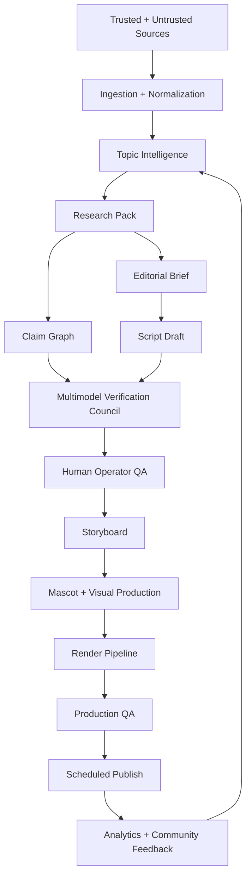

## 4. Multimodel foundation

Animus News is model-agnostic. It must support multiple neural networks per task category and dynamically route work to the best available model for each task.

The goal is to avoid a single-model worldview, reduce hallucination risk, improve specialization, and preserve architectural independence from any one provider.

### 4.1 Model categories

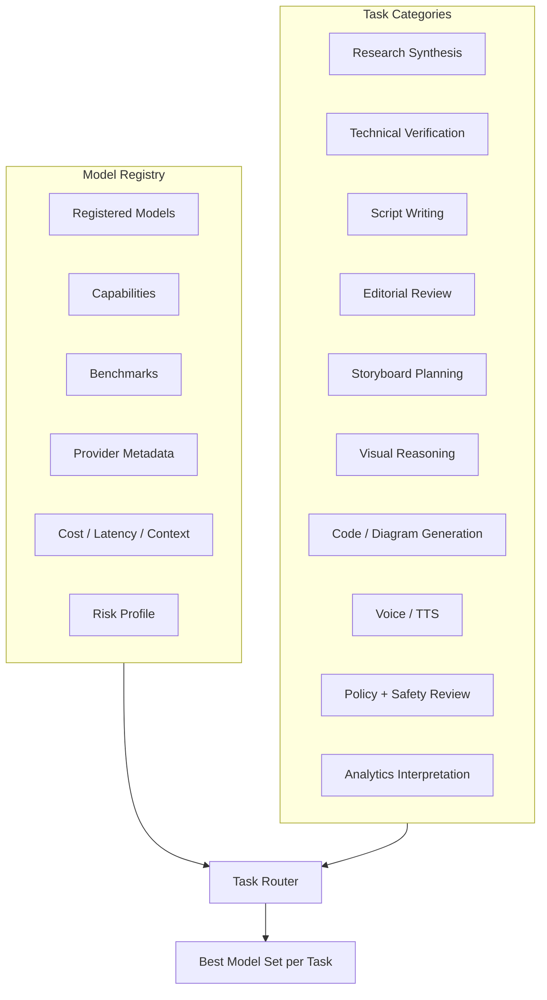

Each model record must include:

- provider;
- model identifier;
- modality support;
- context length;
- structured output reliability;
- tool-use reliability;
- reasoning strength;
- code strength;
- multilingual strength;
- safety behavior;
- latency;
- cost;
- privacy posture;
- supported deployment modes;
- benchmark history;
- known failure modes.

### 4.2 No single-model authority

Critical artifacts are reviewed by a **Multimodel Verification Council** before they reach the human operator.

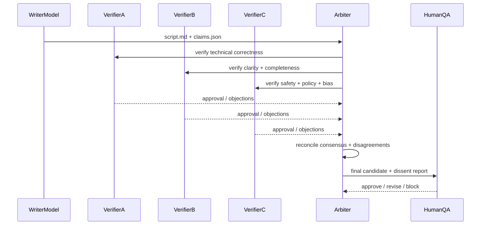

The operator receives:

- final candidate;
- model approvals;
- dissenting opinions;
- unresolved risks;
- unsupported claims;
- quality score;
- recommended decision.

### 4.3 Consensus modes

Different artifacts require different approval policies.

| Artifact | Suggested model policy | Human gate |
|---|---:|---:|
| Topic shortlist | 2-of-3 advisory agreement | Required |
| Research pack | primary model + verifier model | Required for high-risk topics |
| Claims | strict verifier agreement | Required for disputed claims |
| Script | writer + editorial reviewer + technical reviewer | Required |
| Storyboard | creative model + visual reviewer | Optional for low-risk episodes |
| QA report | safety reviewer + technical reviewer + production reviewer | Required |
| Publish manifest | deterministic checks + release reviewer | Required |

### 4.4 Model routing

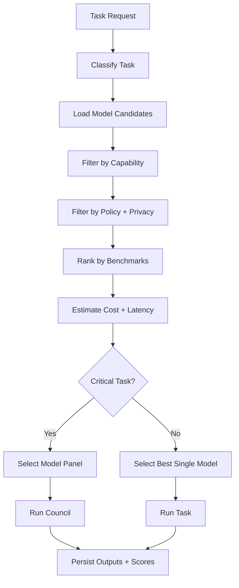

Model routing must be configurable, benchmark-driven, and reversible. No application code should hard-code one provider as the permanent authority.

## 5. End-to-end episode lifecycle

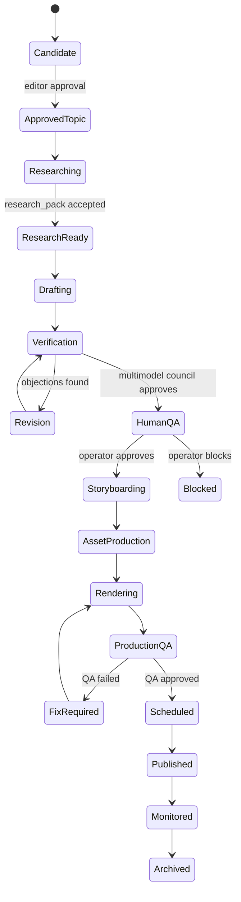

## 6. Canonical artifact graph

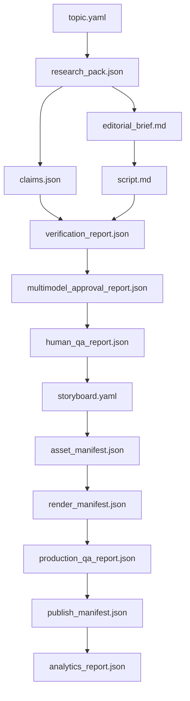

Episode directory:

```text
episodes/<episode-id>/
  topic.yaml
  research_pack.json
  claims.json
  editorial_brief.md
  script.md
  verification_report.json
  multimodel_approval_report.json
  human_qa_report.json
  storyboard.yaml
  asset_manifest.json
  render_manifest.json
  production_qa_report.json
  publish_manifest.json
  analytics_report.json
```

## 7. Knowledge layer

Sources are separated by trust level.

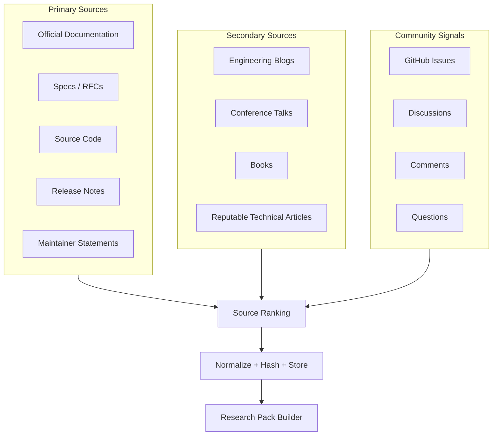

Primary sources outrank secondary sources. Community signals are useful for topic selection and examples, but they do not become authoritative evidence without verification.

## 8. Research pack builder

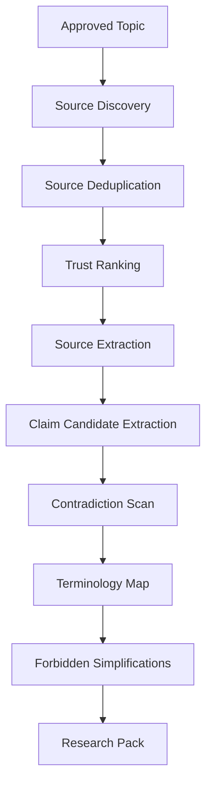

The research pack must define:

- core question;
- target audience;
- learning objectives;
- trusted sources;
- extracted claims;
- unresolved questions;
- known controversies;
- required terminology;
- forbidden simplifications;
- visual opportunities;
- CTA alignment.

## 9. Claim graph

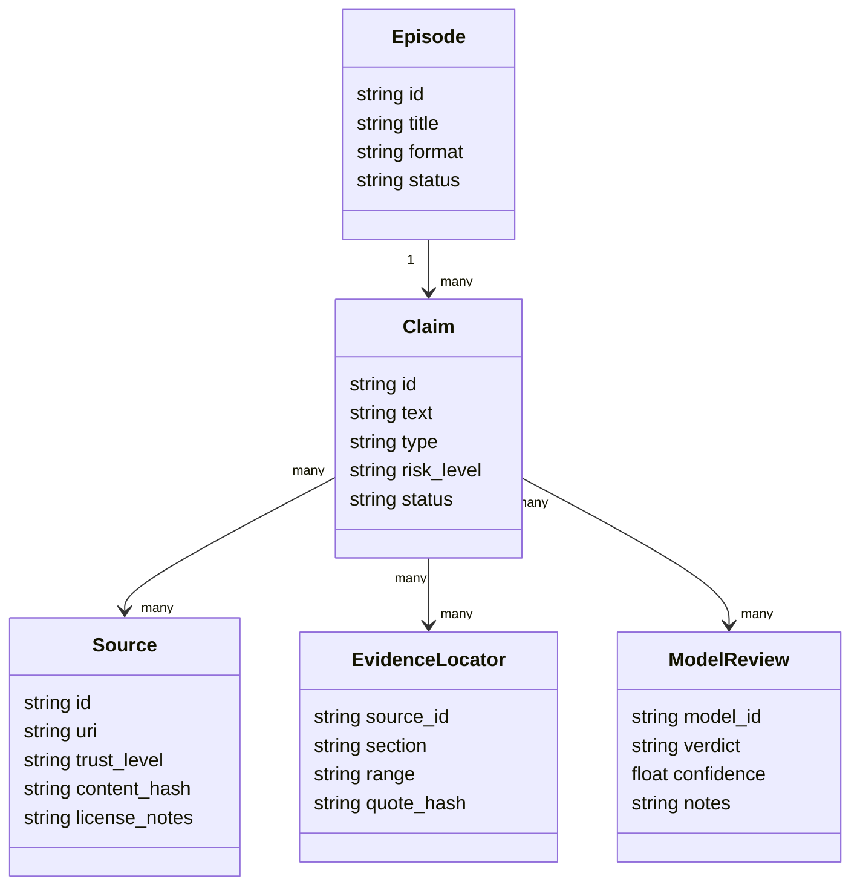

Claim statuses:

- `supported`
- `partially_supported`
- `unsupported`
- `contradicted`
- `needs_human_review`
- `removed`

No high-risk claim may proceed with `unsupported`, `contradicted`, or `needs_human_review` status.

## 10. Production layer

The production layer converts approved script and storyboard into media assets.

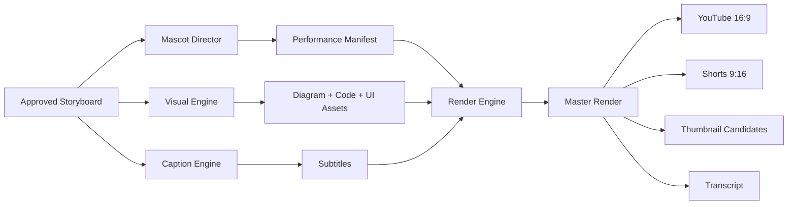

Rendering should prefer deterministic and inspectable assets:

- Remotion / React video for layout;
- FFmpeg for encoding;
- SVG/Mermaid/Graphviz for diagrams;
- Manim for technical animations;
- controlled mascot rig;
- content-addressed asset cache;
- explicit asset manifests.

## 11. Publishing layer

Publishing is staged and gated.

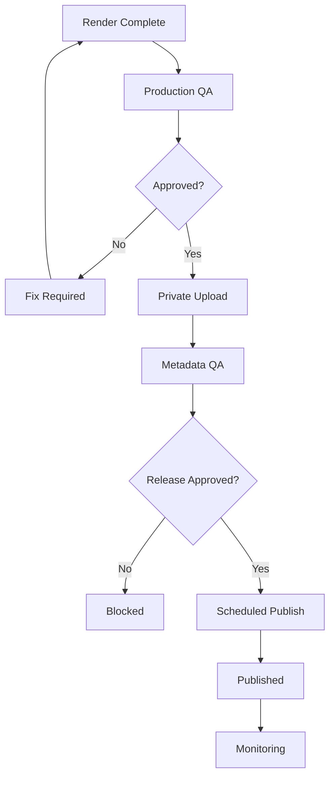

Direct public publishing from generation is forbidden.

## 12. Analytics loop

Analytics improve future content but must not degrade trust.

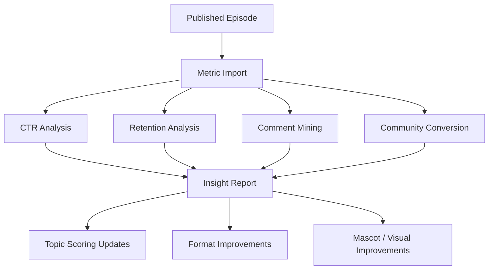

The system should optimize for:

- clarity;
- retention;
- trust;
- community conversion;
- technical accuracy;
- production efficiency.

It must not optimize for misleading clickbait, sensationalism, or engagement bait.

## 13. Deployment architecture

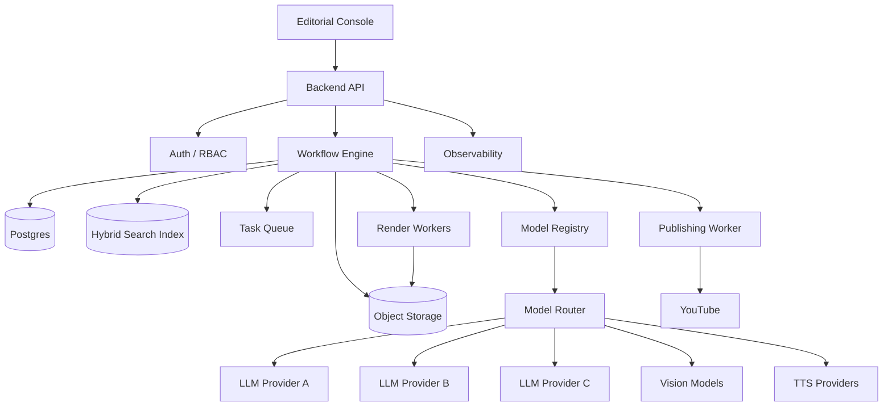

## 14. Trust boundaries

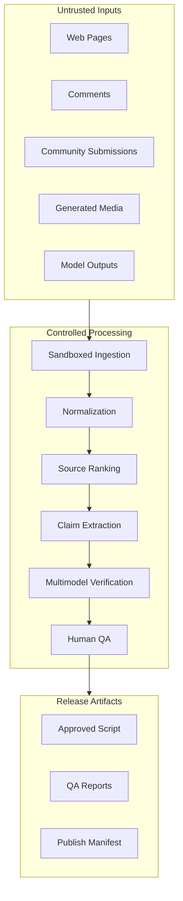

Model outputs are untrusted until validated. A model approval is evidence, not authority.

## 15. System success criteria

Animus News succeeds when it can repeatedly produce episodes that are:

- technically accurate;
- source-grounded;
- visually clear;
- original and transformative;
- useful to newcomers;
- respected by experienced engineers;
- aligned with the Animus community;
- safe to scale;
- auditable after publication;
- efficient enough for low manual operator time;
- independent from any single AI provider.
