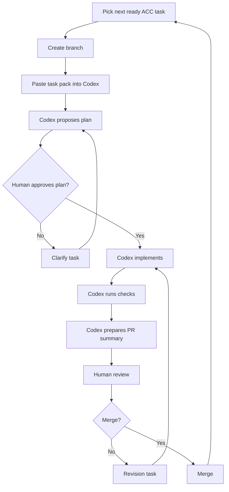

# Codex Execution Guide

## 1. Purpose

This guide explains how to execute the Animus News implementation plan safely with Codex.

Codex should be used as an engineering accelerator inside strict architectural rails. It should not be used as an uncontrolled autonomous architect.

## 2. Operating loop



## 3. Branch naming

Use predictable branch names:

```text
codex/ACC-000-tooling-baseline
codex/ACC-001-ci
codex/ACC-002-artifact-schemas
```

## 4. Task readiness checklist

Before sending a task to Codex:

- [ ] task has an `ACC-xxx` id;
- [ ] dependencies are complete;
- [ ] allowed paths are explicit;
- [ ] forbidden paths are explicit;
- [ ] non-goals are explicit;
- [ ] acceptance criteria are testable;
- [ ] validation commands are listed;
- [ ] security/privacy concerns are listed;
- [ ] expected PR summary is listed.

## 5. Human approval checkpoints

Human approval is required before Codex:

- changes architecture decisions;
- changes canonical artifact names;
- adds real provider integrations;
- adds publishing behavior;
- changes security or privacy logic;
- changes QA or release gates;
- adds new external services;
- introduces a database or workflow engine;
- adds generated binary artifacts.

## 6. Scope discipline

If Codex discovers that a required change is outside the task scope, it must stop and report:

```text
Boundary exception required:
- file/path:
- reason:
- risk:
- proposed change:
- alternative:
```

The human operator decides whether to expand scope or create a new task.

## 7. PR summary format

Codex must produce this summary:

```markdown
## Summary
- ...

## Changed files
- `path`: reason

## Validation
- [ ] `pnpm test`
- [ ] `pnpm typecheck`
- [ ] `pnpm validate`

## Assumptions
- ...

## Risks
- ...

## Boundary exceptions
- None / list

## Follow-ups
- ...
```

## 8. Human review checklist

Reviewers must check:

- task scope respected;
- no unrelated mutations;
- tests pass;
- schema changes have examples;
- quality gates preserved;
- no single provider hard-coded as authority;
- no direct public publishing path;
- no secrets;
- no unsafe external ingestion;
- docs updated only where needed;
- follow-up tasks are explicit.

## 9. Stop conditions

Stop Codex and require human intervention if:

- it proposes broad rewrites;
- it removes quality gates;
- it hard-codes one model provider;
- it adds credentials or secret handling incorrectly;
- it adds direct public publishing;
- it bypasses human QA;
- it changes canonical artifact semantics;
- it cannot run tests and does not explain why;
- it repeatedly changes unrelated files.

## 10. Recommended execution order

Start with:

1. ACC-000 — repo tooling baseline;
2. ACC-001 — CI;
3. ACC-002 — canonical schemas;
4. ACC-003 — validation CLI;
5. ACC-004 — pilot episode template;
6. ACC-005 — model registry;
7. ACC-006 — provider adapter interface;
8. ACC-007 — model router;
9. ACC-008 — mock providers;
10. ACC-009 — council reports.

Do not start rendering, publishing, or analytics before artifacts, schemas, routing, and workflow gates are stable.
