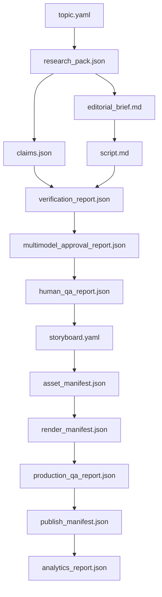

# ACC-012 — Artifact Dependency Graph Enforcement

## Goal

Implement enforcement of the canonical artifact dependency graph so episodes cannot move forward when upstream artifacts are missing, invalid, stale, rejected, or superseded.

This task turns the artifact-driven architecture into an executable gate system.

## Required reading

- `AGENTS.md`
- `docs/SYSTEM_BLUEPRINT.md`
- `docs/QUALITY_GATES.md`
- `docs/SCHEMAS.md`
- `docs/CODEX_MASTER_PLAN.md`

## Dependencies

- ACC-011
- ACC-003

## Scope

Allowed files:

- `src/workflow/**`
- `src/artifacts/**`
- `src/schemas/**` only for validation integration
- `tests/workflow/**`
- `tests/artifacts/**`

## Non-goals

Do not implement:

- model verification;
- rendering;
- publishing adapter;
- database persistence;
- real artifact storage backend.

## Canonical dependency graph



## Requirements

1. Define required artifacts per lifecycle state.
2. Validate required artifacts exist.
3. Validate required artifacts pass schema validation.
4. Reject artifacts with status `rejected` or `superseded` when they are required for progression.
5. Detect stale artifacts if upstream artifact hash/version differs from recorded dependency.
6. Block state transitions when requirements are not satisfied.
7. Return machine-readable dependency errors.

## Transition requirements

Examples:

- Cannot enter `research_ready` without valid `research_pack`.
- Cannot enter `verifying` without valid claims and script.
- Cannot enter `storyboarding` without approved human QA.
- Cannot enter `rendering` without valid storyboard and asset manifest.
- Cannot enter `scheduled` without approved production QA.
- Cannot enter `published` without approved publish manifest.

## Acceptance criteria

- Missing artifact blocks transition.
- Invalid artifact blocks transition.
- Rejected artifact blocks transition.
- Superseded upstream dependency blocks transition.
- Error output identifies exact artifact and reason.
- Tests cover every critical transition.

## Validation commands

```bash
pnpm test
pnpm typecheck
```

## Mutation policy

Forbidden:

- allowing publish states without QA artifacts;
- silently ignoring invalid artifacts;
- treating warnings as approval;
- bypassing human QA dependency.

## PR summary requirements

Include:

- dependency graph implemented;
- transition requirements;
- tests run;
- known limitations;
- follow-up work for durable artifact storage.
