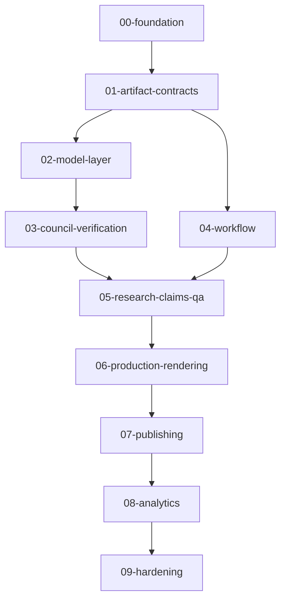

# Codex Task Packs

This directory contains executable task packs for building Animus News into a production-grade, source-grounded, multimodel content compiler.

Each task pack is designed to be copied into Codex as a bounded implementation request.

## Required Codex procedure

Before executing any task, Codex must read:

- `AGENTS.md`
- `README.md`
- `docs/SYSTEM_BLUEPRINT.md`
- `docs/MULTIMODEL_STRATEGY.md`
- `docs/QUALITY_GATES.md`
- `docs/SECURITY_AND_SAFETY.md`
- `docs/SCHEMAS.md`
- `docs/ARCHITECTURE_DECISIONS.md`
- `docs/CODEX_USAGE.md`
- `docs/CODEX_MASTER_PLAN.md`

## Task execution rule

Codex must execute one task pack per branch/PR unless explicitly instructed otherwise.

## Task pack groups

## Status tracking

Task status should be tracked in issues or project board later. For now, task packs are the canonical execution backlog.
